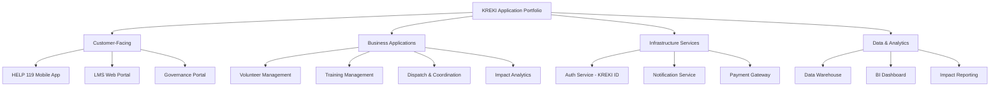
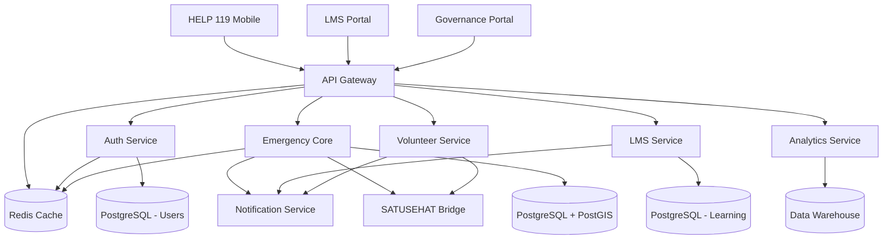

# Application Architecture KREKI

Application Architecture mendefinisikan portfolio aplikasi KREKI, lifecycle, dan bagaimana aplikasi saling berinteraksi untuk mendukung kapabilitas bisnis.

## Application Portfolio Overview



---

## 1. Customer-Facing Applications

### 1.1 HELP 119 Mobile App

**Purpose:** Aplikasi utama untuk masyarakat dan relawan dalam situasi gawat darurat.

**Platform:**
- **Primary:** Android (covers 85%+ Indonesia market)
- **Future:** iOS (for urban areas)

**Key Features:**
| Feature | Description | User Type |
|---------|-------------|-----------|
| **Panic Button** | Tekan 3 detik untuk memanggil bantuan | Public |
| **Volunteer Mode** | Terima notifikasi emergency dan navigasi | Volunteer |
| **Buku Saku Digital** | Panduan medis offline | All |
| **Profile Management** | Kelola profil, sertifikat BHD | Volunteer |
| **Emergency History** | Riwayat panggilan darurat | Volunteer |

**Technology Stack:**
- **Framework:** Flutter (cross-platform) or React Native
- **State Management:** Bloc / Provider
- **Maps:** Google Maps SDK / Mapbox
- **Location:** Fused Location Provider
- **Push Notification:** Firebase Cloud Messaging (FCM)
- **Offline Support:** SQLite for local cache

**Microservices Integration:**
```yaml
Dependencies:
  - Auth Service (KREKI ID)
  - Emergency Core Service (panic button, dispatch)
  - Volunteer Service (profile, availability)
  - Notification Service (FCM token management)
  - SATUSEHAT Bridge (optional integration)
```

**Security Considerations:**
- Biometric auth for volunteer mode
- Encrypted local storage for sensitive data
- Certificate pinning for API calls
- Privacy mode for location tracking

---

### 1.2 LMS Web Portal

**Purpose:** Platform pembelajaran online untuk pelatihan BHD dan sertifikasi.

**Key Features:**
| Feature | Description |
|---------|-------------|
| **Course Catalog** | Daftar kursus BHD, BHD Plus, Disaster Response |
| **Video Player** | Streaming video pelatihan |
| **Interactive Quiz** | Pre-test, post-test, ujian sertifikasi |
| **Progress Tracking** | Track pembelajaran dan completion |
| **Certificate Generation** | Generate sertifikat digital setelah lulus |
| **Instructor Dashboard** | Monitor progres peserta |

**Technology Stack:**
- **Frontend:** React.js / Next.js
- **State Management:** Zustand / Redux
- **Video Streaming:** Mux / Vimeo / YouTube API
- **Payment:** Midtrans / Xendit (for paid courses)

**Microservices Integration:**
```yaml
Dependencies:
  - Auth Service (SSO)
  - LMS Service (course management, quiz)
  - Content Service (materials, videos)
  - Notification Service (course reminders)
```

---

### 1.3 Governance Portal

**Purpose:** Dashboard transparansi untuk donatur, mitra, dan publik.

**Key Features:**
| Feature | Description |
|---------|-------------|
| **Impact Dashboard** | Real-time impact metrics (lives saved, response time) |
| **Financial Transparency** | Laporan keuangan dan penggunaan dana |
| **Operational Metrics** | Volunteer stats, geographic coverage |
| **Project Progress** | Status proyek dan inisiatif |
| **Annual Reports** | Laporan tahunan audited |

**Technology Stack:**
- **Frontend:** Vue.js / Nuxt.js
- **Charts:** Chart.js / D3.js
- **Maps:** Leaflet / Mapbox GL JS

**Microservices Integration:**
```yaml
Dependencies:
  - Auth Service (restricted access for admin)
  - Analytics Service (impact metrics)
  - Data Warehouse (historical data)
```

---

## 2. Business Applications

### 2.1 Volunteer Management System

**Purpose:** Kelola lifecycle relawan dari rekrutmen hingga retensi.

**Capabilities:**
- Registration & onboarding
- Certification tracking
- Availability management
- Performance analytics
- Retention programs

**Implementation:** Part of Volunteer Service microservice

---

### 2.2 Training Management

**Purpose:** Kelola program pelatihan dan sertifikasi.

**Capabilities:**
- Course management
- Instructor assignment
- Session scheduling
- Assessment & grading
- Certificate issuance

**Implementation:** Part of LMS Service microservice

---

### 2.3 Dispatch & Coordination

**Purpose:** Koordinasi emergency response real-time.

**Capabilities:**
- Panic button processing
- Volunteer matching algorithm
- Real-time tracking
- Hospital referral
- Post-emergency documentation

**Implementation:** Part of Emergency Core Service microservice

---

### 2.4 Impact Analytics

**Purpose:** Analitik dampak sosial untuk pengambilan keputusan.

**Capabilities:**
- Response time analysis
- Survival rate tracking
- Volunteer performance
- Geographic coverage
- Trend analysis

**Implementation:** Dedicated Analytics Service (future)

---

## 3. Infrastructure Services

### 3.1 Auth Service (KREKI ID)

**Purpose:** Single Sign-On (SSO) untuk seluruh ekosistem digital KREKI.

**Features:**
- User registration & login
- JWT token management
- Role-based access control (RBAC)
- Social login (Google, Facebook)
- Multi-factor authentication (MFA)

**API Endpoints:**
```
POST   /api/auth/register
POST   /api/auth/login
POST   /api/auth/logout
POST   /api/auth/refresh
GET    /api/auth/me
PUT    /api/auth/me
POST   /api/auth/verify-email
POST   /api/auth/forgot-password
```

**Technology:** Node.js / Go with Passport.js

---

### 3.2 Notification Service

**Purpose:** Kirim notifikasi multi-channel (Push, WhatsApp, Email).

**Channels:**
| Channel | Use Case | Priority |
|---------|----------|----------|
| **FCM Push** | Emergency alerts | Critical |
| **WhatsApp** | Emergency coordination | High |
| **Email** | Certificates, reports | Normal |
| **SMS** | Backup for emergencies | Critical |

**Architecture:**
```
Notification Request → Queue (RabbitMQ) → Worker → Channel API
```

---

### 3.3 Payment Gateway (Future)

**Purpose:** Proses pembayaran untuk kursus berbayar dan donasi.

**Integration:**
- Midtrans
- Xendit
- PayPal (international)

---

## 4. Data & Analytics Applications

### 4.1 Data Warehouse

**Purpose:** Centralized repository untuk analitik dan reporting.

**Data Sources:**
- Emergency requests & responses
- Training records
- Volunteer activities
- System metrics

**Technology:**
- **Current:** PostgreSQL with aggregations
- **Future:** BigQuery / Redshift / Snowflake

---

### 4.2 BI Dashboard

**Purpose:** Visualisasi data real-time dan historis untuk manajemen.

**Tools:**
- **Current:** Grafana / Metabase
- **Future:** Power BI / Tableau

**Dashboards:**
- Operations (response time, volunteer availability)
- Training (enrollment, completion)
- Impact (lives saved, geographic coverage)
- Financial (donations, expenses)

---

### 4.3 Impact Reporting

**Purpose:** Generate laporan dampak untuk donatur dan stakeholder.

**Capabilities:**
- Automated monthly reports
- Custom report generation
- Data export (PDF, Excel)
- API untuk integrasi eksternal

---

## Application Dependency Matrix



---

## Application Lifecycle

### Build vs Buy vs Partner Decision Framework

| Decision Criteria | Build | Buy | Partner |
|-------------------|-------|-----|---------|
| **Core Differentiator** | ✅ | ❌ | ❌ |
| **Commodity Function** | ❌ | ✅ | ❌ |
| **Requires Domain Expertise** | ✅ | ❌ | Partner ✅ |
| **Time to Market Critical** | ❌ | ✅ | ✅ |
| **Budget Constraints** | ❌ | ✅ | Partner ✅ |
| **Data Privacy Critical** | ✅ | Maybe | ❌ |

**KREKI Decisions:**

| Application | Decision | Rationale |
|-------------|----------|-----------|
| **HELP 119 Mobile** | Build | Core differentiator, unique geo-dispatch |
| **Auth Service** | Build | Healthcare data privacy, KREKI ID ecosystem |
| **LMS Platform** | Partner/Buy | Commodity, many LMS solutions available |
| **Payment Gateway** | Buy | Commodity, regulated (Midtrans/Xendit) |
| **Data Warehouse** | Build | Healthcare data, privacy requirements |
| **Email Service** | Buy | Commodity (SendGrid, AWS SES) |
| **Maps API** | Buy | Commodity (Google Maps, Mapbox) |

---

## Integration Patterns

### 1. Synchronous (REST API)

**Use Case:** Request-response yang memerlukan hasil segera

**Examples:**
- Login → Auth validation
- Panic button → Volunteer search
- Profile update → Database write

**Protocol:** HTTP/REST with JSON payload

### 2. Asynchronous (Message Queue)

**Use Case:** Background processing, loose coupling

**Examples:**
- Notification delivery (FCM, WhatsApp)
- Certificate generation (PDF creation)
- Data export (large file generation)

**Protocol:** RabbitMQ / AWS SQS

### 3. Event-Driven (Webhooks)

**Use Case:** Notify external systems of events

**Examples:**
- Emergency created → Notify PSC 119
- Volunteer certified → Update SATUSEHAT
- Donation received → Thank you email

**Protocol:** Webhooks with retry logic

### 4. Batch (Scheduled Jobs)

**Use Case:** Bulk processing, reporting

**Examples:**
- Daily impact metrics calculation
- Monthly report generation
- Data archival (cold storage)

**Protocol:** Cron jobs / AWS EventBridge

---

## Application Migration Roadmap

### Current State (2025)

**Production:**
- ✅ Auth Service (MVP)
- ✅ Emergency Core Service (MVP)
- ✅ HELP 119 Mobile App (Android)
- ✅ LMS Portal (Basic)

**In Development:**
- 🚧 Volunteer Service (enhanced)
- 🚧 Notification Service (multi-channel)
- 🚧 Governance Portal (MVP)

### Target State (2026)

**Enhanced Production:**
- Complete microservices ecosystem
- iOS version of HELP 119
- Advanced analytics & ML
- SATUSEHAT full integration
- Real-time BI dashboards

**Migration Path:**
```
Q1 2025: Core services stable
Q2 2025: Enhanced volunteer management
Q3 2025: Multi-channel notifications
Q4 2025: Advanced analytics & BI
Q1 2026: SATUSEHAT full integration
Q2 2026: iOS app launch
```

---

## Application Metrics & Monitoring

### Key Performance Indicators

| Application | KPI | Target |
|-------------|-----|--------|
| **HELP 119 Mobile** | Crash-free users | > 99.5% |
| **LMS Portal** | Page load time | < 2s (P95) |
| **Auth Service** | Login success rate | > 98% |
| **Emergency Core** | API response time | < 500ms (P95) |
| **Notification Service** | Delivery rate | > 95% |

### Monitoring Tools

- **Application Performance:** New Relic / Datadog
- **Error Tracking:** Sentry
- **Uptime:** UptimeRobot / Pingdom
- **Analytics:** Mixpanel / Amplitude (in-app)

---

## Related Documentation

- [Microservices Design](../microservices-design.md) - Detail microservices
- [System Architecture](../system-architecture.md) - Technical architecture
- [API Reference](../api-reference.md) - API documentation
- [Integration Architecture](./integration-architecture.md) - Integration patterns

---

*Kembali ke [Enterprise Architecture](./index.md)*
