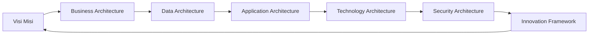

# Enterprise Architecture KREKI

Selamat datang di **Enterprise Architecture (EA) KREKI** - kerangka "rumah tumbuh" yang memberikan arah yang jelas bagi ekosistem sistem informasi, tata kelola, dan inovasi KREKI.

## Apa itu Enterprise Architecture?

Enterprise Architecture adalah **peta strategis** yang menghubungkan:
- **Visi Bisnis** → Kapabilitas yang dibutuhkan
- **Kapabilitas** → Aplikasi dan data yang diperlukan
- **Aplikasi & Data** → Teknologi yang mendukung
- **Teknologi** → Tata kelola dan keamanan

EA menjawab pertanyaan: *"Bagaimana kita membangun ekosistem digital yang skalabel, aman, dan selaras dengan misi KREKI?"*

## Filosofi "Rumah Tumbuh"

EA KREKI dirancang sebagai **dokumen hidup** yang:

**Prinsip Utama:**
- **Modular**: Setiap domain dapat berkembang mandiri
- **Ekstensibel**: Mudah menambah kapabilitas/aplikasi/teknologi baru
- **Version-Controlled**: Git-based dengan riwayat perubahan jelas
- **Living Document**: Review triwulan, refresh tahunan

---

## Prinsip Dasar Arsitektur

Lima prinsip inti yang menjadi landasan arsitektur KREKI:

### 1. Misi di atas Teknologi (Mission First - Technology Enables)

Teknologi diposisikan sebagai pendukung pencapaian tujuan kemanusiaan, bukan sebagai faktor penentu arah organisasi.

**Implementasi:**
- Prioritas tetap pada penyelamatan jiwa dan peningkatan kesiapsiagaan komunitas
- Keputusan teknis harus selaras dengan mandat misi kemanusiaan
- Technology enables mission, not drives it

**Risiko jika dilanggar:** Teknologi mendominasi, misi bergeser, penurunan relevansi dan efektivitas

### 2. Pemberdayaan Komunitas (Community Empowerment)

Arsitektur dirancang untuk memperkuat kapasitas komunitas sebagai *first responder*, bukan hanya mengandalkan institusi formal.

**Implementasi:**
- Mendukung pelatihan, koordinasi, dan kemandirian komunitas
- Desain sistem yang dapat digunakan langsung oleh warga
- Komunitas sebagai aktor utama respon emergensi

**Risiko jika dilangkat:** Lemahnya kesiapsiagaan grassroots, peningkatan keterlambatan respons

### 3. Integrasi Nasional & Interoperabilitas (National Integration)

Sistem harus selaras dengan tata kelola nasional dan terhubung secara aman, standar, dan fungsional lintas platform.

**Implementasi:**
- Mendukung integrasi dengan PSC 119, SATUSEHAT, dan sistem kesehatan lainnya
- Mengikuti standar nasional untuk interoperabilitas data
- Keterhubungan dengan ekosistem emergensi nasional

**Risiko jika dilangkat:** Fragmentasi sistem, gangguan koordinasi, hilangnya efektivitas ekosistem emergensi

### 4. Berbasis Data & KPI (Evidence & KPI Driven)

Keputusan, evaluasi, dan pengembangan sistem berbasis bukti dan indikator kinerja yang terukur.

**Implementasi:**
- Memiliki kemampuan pengambilan data, analitik, dan pelaporan
- Keputusan berdasarkan data, bukan asumsi
- KPI strategis dan operasional yang jelas

**Risiko jika dilangkat:** Kegagalan evaluasi, arah kebijakan salah, pemborosan sumber daya

### 5. Tangguh & Berkelanjutan (Resilience & Sustainability)

Sistem dan organisasi dirancang untuk withstand gangguan, adaptif, dan memastikan keberlanjutan jangka panjang.

**Implementasi:**
- Platform dengan keandalan tinggi, kontinuitas, dan kesiapan pemulihan
- Desain untuk resiliensi dan business continuity
- Keberlanjutan operasional jangka panjang

**Risiko jika dilangkat:** Kegagalan layanan saat krisis, hilangnya kepercayaan publik, ketidakterberlanjutan sistem

---

## Domain Enterprise Architecture

KREKI mengadopsi **TOGAF 9.2 (Simplified)** dengan 8 domain utama:

### 1. Business Architecture
Memetakan kapabilitas bisnis, value stream, dan stakeholder.

**Fokus:**
- Business Capability Map
- Value Stream Analysis
- Stakeholder Mapping
- Organizational Structure

[Selengkapnya →](./business-architecture.md)

---

### 2. Data Architecture
Mengelola aset data sebagai sumber kebenaran tunggal.

**Fokus:**
- Data Domain Model
- Data Entity Catalog
- Data Governance
- Privacy & Compliance (PDP Law 2022)

[Selengkapnya →](./data-architecture.md)

---

### 3. Application Architecture
Portfolio aplikasi dengan lifecycle dan dependensi.

**Fokus:**
- Application Portfolio
- Build vs Buy vs Partner
- Integration Patterns
- Migration Roadmap

[Selengkapnya →](./application-architecture.md)

---

### 4. Technology Architecture
Standar teknologi dan reference model.

**Fokus:**
- Technology Reference Model
- Infrastructure Standards
- Technology Radar
- Emerging Technology Watchlist

[Selengkapnya →](./technology-architecture.md)

---

### 5. Security Architecture
Domain keamanan menyeluruh (Zero Trust).

**Fokus:**
- Security Domains
- Controls Catalog
- PDP Law 2022 Compliance
- Healthcare Security Standards

[Selengkapnya →](./security-architecture.md)

---

### 6. Integration Architecture
Pola integrasi dan standar eksternal.

**Fokus:**
- Integration Patterns
- External Integration Catalog
- API Governance
- FHIR & SATUSEHAT Standards

[Selengkapnya →](./integration-architecture.md)

---

### 7. Innovation Framework
Antisipasi kebaruan dan teknologi emerging.

**Fokus:**
- Technology Radar (Adopt, Trial, Assess, Hold)
- Emerging Technology Assessment
- Pilot/Experiment Framework
- Innovation Pipeline

[Selengkapnya →](./innovation-framework.md)

---

### 8. EA Governance
Tata kelola EA dan siklus pembaruan.

**Fokus:**
- EA Governance Structure
- Update Cycle (Quarterly/Annual)
- EA Compliance
- Communication Strategy

[Selengkapnya →](./ea-governance.md)

---

### 9. Risk Management
Manajemen risiko enterprise dan framework mitigasi.

**Fokus:**
- Risk Register (Governance, Operational, Technology, Privacy)
- Risk Assessment & Treatment
- Risk Governance & Roles
- KPI Risiko

[Selengkapnya →](./risk-management.md)

---

## Peta Jalan Evolusi EA

Lihat rencana evolusi EA dari current state ke target state:

[EA Roadmap →](./roadmap.md)

---

## Hubungan dengan Dokumentasi Lain

EA KREKI terintegrasi dengan dokumentasi lain:

| EA Domain | Dokumentasi Terkait |
|-----------|-------------------|
| Business Architecture | [About KREKI](../about/), [Volunteer Program](../about/volunteer-program.md) |
| Data Architecture | [System Architecture](../architecture/system-architecture.md) |
| Application Architecture | [Microservices Design](../architecture/microservices-design.md) |
| Technology Architecture | [System Architecture](../architecture/system-architecture.md), [Engineering Handbook](../../engineering/handbook.md) |
| Security Architecture | [IT Governance](../governance/it-governance.md) |
| Integration Architecture | [Stakeholder Integration](../governance/stakeholder-integration.md), [API Reference](../architecture/api-reference.md) |

---

## Mulai dari Mana?

### Untuk Pemangku Kebijakan
Baca **Business Architecture** dan **EA Roadmap** untuk memahami:
- Kapabilitas strategis yang dibutuhkan
- Rencana evolusi sistem informasi
- Investasi teknologi yang prioritas

### Untuk Architect/Technical Lead
Mulai dari **Technology Architecture** dan **Application Architecture**:
- Standar teknologi yang disepakati
- Portfolio aplikasi dan dependensi
- Integrasi pattern yang digunakan

### Untuk Product Manager
Fokus pada **Business Architecture** dan **Innovation Framework**:
- Kapabilitas bisnis yang didukung sistem
- Teknologi emerging yang relevan
- Value stream untuk setiap produk

### Untuk Developer
Lihat **Application Architecture**, **Data Architecture**, dan **Integration Architecture**:
- Microservices yang tersedia
- API dan data yang dapat diakses
- Standar integrasi yang harus diikuti

---

## Kontribusi pada EA

EA adalah dokumen hidup yang diperbarui secara berkala. Untuk berkontribusi:

1. **Propose Changes**: Ajukan perubahan via Pull Request
2. **Quarterly Review**: Ikuti review triwulan untuk update major
3. **Annual Refresh**: Partisipasi inisiatif refresh tahunan

Lihat [EA Governance](./ea-governance.md) untuk prosedur lengkap.

---

## Dukungan & Kontak

Untuk pertanyaan seputar EA KREKI:

- **Email**: it-support@kreki.or.id
- **Technical Board**: Review major changes di review triwulan
- **GitHub Issues**: Laporkan gap atau inconsistency

---

*Enterprise Framework KREKI | Version 1.0 | Last Updated: 2025-01-08*
