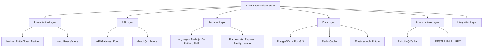

# Technology Architecture KREKI

Technology Architecture mendefinisikan standar teknologi, reference model, dan technology radar untuk memandu keputusan teknologi KREKI.

## Technology Reference Model



---

## 1. Presentation Layer

### Mobile Applications

| Technology | Status | Rationale |
|------------|--------|-----------|
| **Flutter** | ADOPT | Cross-platform, good performance, large talent pool |
| **React Native** | ASSESS | Alternative to Flutter, larger ecosystem |
| **Native (Swift/Kotlin)** | HOLD | High maintenance for two platforms |

**Decision:** Flutter untuk HELP 119 mobile app (Android first, iOS later)

### Web Applications

| Technology | Status | Rationale |
|------------|--------|-----------|
| **React.js** | ADOPT | Large ecosystem, good performance, reusable components |
| **Vue.js / Nuxt.js** | ADOPT | For Governance Portal (simpler learning curve) |
| **Next.js** | TRIAL | For SEO-critical pages (future) |
| **Angular** | HOLD | Steep learning curve, declining popularity |

**Decisions:**
- React.js untuk LMS Portal
- Vue.js / Nuxt.js untuk Governance Portal

### UI Component Libraries

| Library | Status | Rationale |
|---------|--------|-----------|
| **Tailwind CSS** | ADOPT | Utility-first, consistent design system |
| **Material UI** | ASSESS | Comprehensive components, larger bundle size |
| **Chakra UI** | TRIAL | Accessible, composable components |
| **Bootstrap** | HOLD | Outdated patterns, customization difficult |

---

## 2. API Layer

### API Gateway

| Technology | Status | Rationale |
|------------|--------|-----------|
| **Kong** | ADOPT | Feature-rich, plugin ecosystem, open source |
| **NGINX** | ADOPT | Lightweight, battle-tested (can use with Kong) |
| **AWS API Gateway** | ASSESS | Good if fully on AWS, lock-in concerns |
| **Express.js custom** | HOLD | Reinventing the wheel, maintenance burden |

**Decision:** Kong sebagai API Gateway dengan NGINX sebagai reverse proxy

### API Styles

| Style | Status | Use Case |
|-------|--------|----------|
| **RESTful** | ADOPT | Standard API for most services |
| **GraphQL** | TRIAL | For complex queries (LMS, Analytics) |
| **gRPC** | ASSESS | For inter-service communication (high performance) |
| **SOAP** | HOLD | Legacy only (SATUSEHAT may require) |

---

## 3. Services Layer

### Programming Languages

| Language | Status | Use Case | Rationale |
|----------|--------|----------|-----------|
| **Node.js** | ADOPT | Emergency Core, Notification | Fast I/O, async, large ecosystem |
| **Go** | ADOPT | Auth, Volunteer, SATUSEHAT Bridge | Fast, compiled, strong concurrency |
| **Python** | ADOPT | LMS, Analytics | Rich data science libraries |
| **PHP** | TRIAL | LMS alternative | Easier for junior developers/interns |

### Frameworks

| Framework | Language | Status | Use Case |
|-----------|----------|--------|----------|
| **Express.js** | Node.js | ADOPT | REST APIs, lightweight |
| **Fastify** | Node.js | TRIAL | High-performance API |
| **Gin / Echo** | Go | ADOPT | REST APIs |
| **Laravel** | PHP | TRIAL | LMS with admin panel |
| **Django** | Python | ADOPT | LMS alternative |

---

## 4. Data Layer

### Databases

| Database | Status | Use Case | Rationale |
|----------|--------|----------|-----------|
| **PostgreSQL** | ADOPT | Primary database for all services | Reliable, feature-rich, PostGIS support |
| **PostGIS** | ADOPT | Geospatial queries (Emergency Core) | Industry standard for GIS |
| **Redis** | ADOPT | Cache, session management | Fast in-memory data store |
| **Elasticsearch** | TRIAL | Full-text search (logs, documents) | Powerful search, scaling concerns |
| **MongoDB** | HOLD | Considered, but SQL preferred | Document model not a fit |

### Data Warehousing

| Technology | Status | Use Case | Rationale |
|------------|--------|----------|-----------|
| **PostgreSQL (aggregations)** | ADOPT | Current analytics | Sufficient for current scale |
| **BigQuery** | TRIAL | Future data warehouse | Serverless, pay-per-query |
| **Redshift** | ASSESS | Alternative to BigQuery | AWS ecosystem |
| **Snowflake** | HOLD | Too expensive for NGO |

---

## 5. Infrastructure Layer

### Container Orchestration

| Technology | Status | Rationale |
|------------|--------|-----------|
| **Docker** | ADOPT | Container standard |
| **Kubernetes** | TRIAL | Complex setup, overkill for current scale |
| **Docker Swarm** | ADOPT | Simpler than K8s, sufficient for current needs |
| **AWS ECS** | ASSESS | If fully committed to AWS |

**Current Decision:** Docker Swarm untuk kemudahan manajemen
**Future Consideration:** Kubernetes jika scale mencapai 50+ containers

### Cloud Providers

| Provider | Status | Use Case | Rationale |
|----------|--------|----------|-----------|
| **AWS** | ADOPT | Primary cloud for critical services | Most complete services in Indonesia |
| **GCP** | ASSESS | Alternative, BigQuery for analytics | Strong data/analytics |
| **AliCloud** | ASSESS | Cost-effective alternative | Good presence in Indonesia |
| **Azure** | HOLD | No specific advantage | Lower adoption in Indonesia |

**Strategy:** Hybrid multi-cloud untuk disaster recovery
- **Primary:** AWS (Emergency Core, Auth)
- **Secondary:** GCP or AliCloud (LMS, Analytics)

### CDN & Static Assets

| Service | Status | Rationale |
|---------|--------|-----------|
| **Cloudflare** | ADOPT | Global CDN, free tier generous | Good Indonesia coverage |
| **AWS CloudFront** | ASSESS | If fully on AWS | Integrates well with S3 |
| **Fastly** | HOLD | More expensive | No significant advantage |

---

## 6. Integration Layer

### Message Queues

| Technology | Status | Rationale |
|------------|--------|-----------|
| **RabbitMQ** | ADOPT | Feature-rich, proven | Good for current scale |
| **Kafka** | ASSESS | High-volume event streaming | Overkill for current needs |
| **AWS SQS** | TRIAL | If using AWS | Simple, managed |
| **Redis Pub/Sub** | HOLD | Simple use cases only | Limited features |

### APIs & Protocols

| Protocol | Status | Use Case |
|----------|--------|----------|
| **RESTful JSON** | ADOPT | Standard API |
| **FHIR R4** | ADOPT | Healthcare data exchange (SATUSEHAT) |
| **gRPC** | TRIAL | Inter-service communication |
| **WebSockets** | ADOPT | Real-time features (live tracking) |
| **Webhooks** | ADOPT | Event notifications to external systems |

---

## Technology Radar

Technology Radar membantu KREKI mengambil keputusan teknologi dengan memetakan teknologi ke 4 kuadran:

### ADOPT
Teknologi yang terbukti, produksi-ready, dan direkomendasikan untuk penggunaan luas.

```
Frontend:
├── Flutter (Mobile)
├── React.js (Web)
├── Vue.js (Web)
└── Tailwind CSS

Backend:
├── Node.js (API services)
├── Go (Performance-critical services)
├── Python (Analytics, ML)
├── Express.js, FastAPI
└── Gin/Echo (Go frameworks)

Data:
├── PostgreSQL + PostGIS
├── Redis (Cache)
└── Docker (Containers)

Infrastructure:
├── Docker Swarm (Orchestration)
├── AWS (Cloud provider)
├── Cloudflare (CDN)
└── Kong (API Gateway)

Integration:
├── RESTful APIs
├── FHIR R4 (Healthcare)
├── WebSockets (Real-time)
└── RabbitMQ (Messaging)
```

### TRIAL
Teknologi menjanjikan yang layak diuji dalam proyek pilot atau skala kecil.

```
Frontend:
├── Next.js (SSR for SEO)
└── GraphQL (API layer)

Backend:
├── Fastify (High-performance Node.js)
├── gRPC (Inter-service communication)
└── Laravel (PHP for LMS)

Data:
├── Elasticsearch (Full-text search)
└── BigQuery (Data warehouse)

Infrastructure:
├── Kubernetes (If scale justifies)
├── AWS ECS (Managed containers)
└── Terraform (Infrastructure as Code)

Analytics:
├── Apache Airflow (Data pipeline)
└── dbt (Data transformation)

Features:
├── Event-Driven Architecture (RabbitMQ)
├── Machine Learning (Dispatch optimization)
└── Offline-first Mobile (PWA)
```

### ASSESS
Teknologi yang perlu dievaluasi lebih lanjut sebelum adopsi.

```
Frontend:
├── React Native (Alternative to Flutter)
└── Angular (Declining popularity)

Backend:
├── Kubernetes (Complexity vs benefit)
├── Java/Spring Boot (Enterprise adoption)
└── .NET Core (Microsoft ecosystem)

Data:
├── MongoDB (Document database)
├── Redis Cluster (Distributed cache)
└── TimescaleDB (Time-series data)

Infrastructure:
├── Google Cloud Platform (Alternative to AWS)
├── AliCloud (Cost optimization)
├── Azure (Microsoft ecosystem)
└── DigitalOcean (Simpler hosting)

Integration:
├── Kafka (Event streaming platform)
├── AWS MSK (Managed Kafka)
└── GraphQL Federation (Distributed GraphQL)
```

### HOLD
Teknologi yang tidak direkomendasikan untuk penggunaan baru.

```
Frontend:
├── Native development (Swift/Kotlin) - High maintenance
├── jQuery - Outdated
└── Bootstrap - Outdated patterns

Backend:
├── Monolithic architecture - Against microservices
├── SOAP - Legacy, complex
└── XML - JSON preferred

Data:
├── MySQL - Less features than PostgreSQL
├── SQLite - For local cache only
└── Cassandra - Overkill for current scale

Infrastructure:
├── On-premise only - No cloud benefit
├── Manual server setup - Not reproducible
└── Single cloud provider lock-in - Avoid vendor lock-in

Practices:
├── Synchronous-only integrations - Not resilient
├── No monitoring - Operational risk
└── Manual deployments - Error-prone
```

---

## Emerging Technology Watchlist

Teknologi emerging yang perlu dipantau untuk adopsi di masa depan:

### 1-2 Years (Near-term)

| Technology | Potential Use Case | Impact |
|------------|-------------------|--------|
| **Offline-first Mobile** | HELP 119 app di area low-connectivity | High |
| **ML-based Dispatch Optimization** | Improve volunteer matching | High |
| **Blockchain Credential Verification** | Verify BHD certificates authenticity | Medium |
| **Edge Computing** | Reduce latency for critical services | Medium |

### 2-5 Years (Mid-term)

| Technology | Potential Use Case | Impact |
|------------|-------------------|--------|
| **AI/ML Triage Assistance** | Assist volunteers in assessing severity | High |
| **IoT Integration** | Smart devices for emergency detection | Medium |
| **5G-based Emergency Video** | Real-time video consultation | High |
| **Digital Twins** | Simulation for disaster preparedness | Low-Medium |

### 5+ Years (Long-term)

| Technology | Potential Use Case | Impact |
|------------|-------------------|--------|
| **Augmented Reality (AR)** | Guide volunteers through medical procedures | Medium |
| **Autonomous Drones** | Deliver AED to emergency location | High |
| **Quantum Computing** | Optimize large-scale disaster response | Low (speculative) |

---

## Technology Standards & Guidelines

### Coding Standards

**Language-Specific Guidelines:**

| Language | Style Guide | Linter | Formatter |
|----------|------------|--------|-----------|
| **JavaScript/TypeScript** | Airbnb Style Guide | ESLint | Prettier |
| **Go** | Effective Go | golint | gofmt |
| **Python** | PEP 8 | pylint | black |
| **PHP** | PSR-12 | PHP CS Fixer | PHP CS Fixer |

### API Design Standards

**RESTful API Conventions:**
- Use kebab-case for URLs: `/api/volunteer-skills`
- Use plural nouns for resources: `/users`, `/emergencies`
- HTTP verbs for actions: GET, POST, PUT, DELETE
- Pagination: `?page=1&limit=20`
- Filtering: `?status=active&skill=bhd`
- Versioning: `/api/v1/`, `/api/v2/`

**Response Format:**
```json
{
  "success": true,
  "data": { ... },
  "error": null,
  "meta": {
    "page": 1,
    "limit": 20,
    "total": 150
  }
}
```

### Security Standards

**Mandatory Security Practices:**
- Input validation on all endpoints
- SQL injection prevention (parameterized queries)
- XSS prevention (output encoding)
- CSRF tokens for state-changing operations
- Rate limiting (5 req/sec per IP)
- API authentication (JWT, OAuth2)

---

## Technology Decision Process

### Proposal Template

Untuk mengusulkan teknologi baru:

```markdown
## Technology Proposal: [Name]

**Background:** Why are we considering this?

**Alternatives Considered:** What else did we evaluate?

**Pros:** Benefits of this technology

**Cons:** Drawbacks and risks

**Use Case:** Specific problem it solves

**Estimated Effort:** Implementation cost (time, money)

**Recommendation:** Adopt, Trial, Assess, or Hold?
```

### Approval Authority

| Technology Type | Approver |
|-----------------|----------|
| **Frontend Framework** | Lead Frontend Dev |
| **Backend Framework** | Lead Backend Dev |
| **Database** | Data Architect + CTO |
| **Infrastructure** | DevOps Lead + CTO |
| **Major Change** | Technical Board |

---

## Related Documentation

- [System Architecture](../architecture/system-architecture.md) - Technical architecture
- [Microservices Design](../architecture/microservices-design.md) - Service specifications
- [Engineering Handbook](../../engineering/handbook.md) - Development practices

---

*Kembali ke [Enterprise Architecture](./index.md)*
