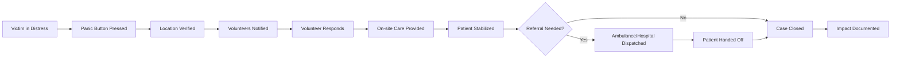
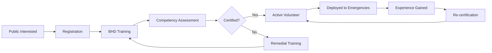
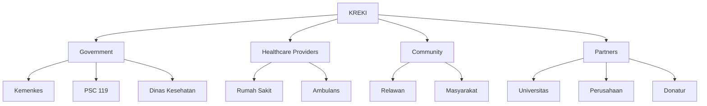

# Business Architecture KREKI

Business Architecture memetakan kapabilitas strategis KREKI, value stream yang menghasilkan nilai, dan stakeholder yang dilayani.

## Visi & Misi

### Visi
> *"Menjadi jaringan relawan emergensi kesehatan terdepan di Indonesia yang menghubungkan masyarakat dengan pertolongan medis cepat dan tepat."*

### Misi
1. **Mengurangi Response Time**: Menghubungkan korban dengan relawan < 5 menit (urban), < 8 menit (rural)
2. **Meningkatkan Survival Rate**: Mencapai survival rate > 40% untuk kondisi kritis (cardiac arrest)
3. **Membangun Komunitas**: 10 relawan terlatih per 10.000 penduduk
4. **Integrasi Ekosistem**: Terhubung dengan PSC 119, rumah sakit, dan SATUSEHAT

---

## Business Capability Map

Kapabilitas bisnis KREKI diorganisir secara hierarkis:

```mermaid
graph TD
    BA[KREKI Business Capabilities]

    BA --> ER[Emergency Response]
    BA --> VM[Volunteer Management]
    BA --> TE[Training & Education]
    BA --> GC[Governance & Compliance]
    BA --> CE[Community Engagement]

    ER --> ER1[Panic Button Management]
    ER --> ER2[Volunteer Dispatch]
    ER --> ER3[Medical Coordination]
    ER --> ER4[Patient Handoff]

    VM --> VM1[Recruitment]
    VM --> VM2[Training & Certification]
    VM --> VM3[Deployment]
    VM --> VM4[Retention]

    TE --> TE1[BHD Training]
    TE --> TE2[Advanced Courses]
    TE --> TE3[Certification]
    TE --> TE4[LMS Platform]

    GC --> GC1[Quality Assurance]
    GC --> GC2[Regulatory Compliance]
    GC --> GC3[Reporting]
    GC --> GC4[Transparency]

    CE --> CE1[Public Awareness]
    CE --> CE2[Partnership Development]
    CE --> CE3[Fundraising]
```



### Level 1: Emergency Response

| Level 2 | Level 3 | Description |
|---------|---------|-------------|
| **Panic Button Management** | Request Triggering | Menerima dan memvalidasi panic button dari masyarakat |
| | Location Verification | Verifikasi lokasi kejadian via GPS |
| | Severity Classification | Klasifikasi tingkat kegawatan |
| **Volunteer Dispatch** | Nearest Volunteer Search | Algoritma pencarian relawan terdekat (500m-2km) |
| | Notification Delivery | Kirim notifikasi ke relawan tersedia |
| | Response Tracking | Lacak perjalanan relawan ke lokasi |
| **Medical Coordination** | Tele-consultation | Koordinasi medis antara relawan-korban-RS |
| | Resource Matching | Matching kebutuhan dengan ketersediaan |
| **Patient Handoff** | Referral Management | Rujukan ke rumah sakit/ambulans |
| | Documentation | Dokumentasi kejadian untuk pelaporan |

### Level 1: Volunteer Management

| Level 2 | Level 3 | Description |
|---------|---------|-------------|
| **Recruitment** | Registration | Pendaftaran relawan baru |
| | Vetting | Verifikasi kompetensi dan sertifikat |
| | Onboarding | Orientasi sistem dan prosedur |
| **Training & Certification** | BHD Training | Pelatihan Bantuan Hidup Dasar |
| | Skills Assessment | Penilaian keterampilan praktik |
| | Certification | Penerbitan sertifikat kompetensi |
| **Deployment** | Availability Management | Manajemen status tersedia/tidak |
| | Geo-distribution | Distribusi relawan per wilayah |
| | Activation | Aktivasi relawan saat emergency |
| **Retention** | Engagement | Program engagement relawan |
| | Recognition | Penghargaan dan apresiasi |
| | Re-certification | Renewal sertifikat periodik |

### Level 1: Training & Education

| Level 2 | Level 3 | Description |
|---------|---------|-------------|
| **BHD Training** | Basic Life Support | RJP, tersedak, pendarahan |
| | First Aid | Pertolongan pertama sehari-hari |
| | AED Usage | Penggunaan defibrillator |
| **Advanced Courses** | BHD Plus | Advanced cardiac life support |
| | Disaster Response | Penanganan korban massal |
| | Instructor Training | Training of Trainers |
| **Certification** | Assessment | Ujian kompetensi teori & praktik |
| | Issuance | Penerbitan sertifikat digital |
| | Verification | Verifikasi sertifikat oleh employer |
| **LMS Platform** | Content Delivery | Video, modul, quiz online |
| | Progress Tracking | Lacak progres pembelajaran |
| | Analytics | Analitik pembelajaran |

### Level 1: Governance & Compliance

| Level 2 | Level 3 | Description |
|---------|---------|-------------|
| **Quality Assurance** | Standard Enforcement | Pastikan standar medis dipatuhi |
| | Performance Monitoring | Monitor performa relawan |
| | Incident Review | Review insiden untuk pembelajaran |
| **Regulatory Compliance** | Kemenkes Compliance | Patuh regulasi Kemenkes |
| | PSC 119 Integration | Integrasi dengan PSC 119 nasional |
| | Data Privacy | Kepatuhan UU PDP 2022 |
| **Reporting** | Impact Metrics | Laporan dampak sosial |
| | Operational Metrics | Laporan operasional |
| | Financial Reports | Laporan keuangan transparansi |
| **Transparency** | Public Dashboard | Dashboard publik untuk donatur |
| | Open Data | Data terbuka untuk peneliti |
| | Stakeholder Communication | Komunikasi rutin dengan stakeholder |

### Level 1: Community Engagement

| Level 2 | Level 3 | Description |
|---------|---------|-------------|
| **Public Awareness** | Education Campaign | Kampanye edukasi BHD untuk publik |
| | App Promotion | Promosi download aplikasi |
| | Success Stories | Cerita sukses untuk inspirasi |
| **Partnership Development** | Government Partners | Kemitraan dengan Kemenkes, Pemda |
| | Academic Partners | Kemitraan dengan universitas |
| | Private Partners | Kemitraan dengan perusahaan (CSR) |
| **Fundraising** | Grant Applications | Ajukan hibah domestik/internasional |
| | Corporate Sponsorship | Sponsorship perusahaan |
| | Public Donation | Donasi publik via platform |

---

## Value Streams

Value stream menggambarkan alur penciptaan nilai dari permintaan sampai outcome.

### Value Stream: Emergency Response



**Value Creation Points:**
- **Speed**: Response time < 5 min (urban) → Higher survival
- **Quality**: Trained volunteers → Proper first aid
- **Continuity**: Handoff to professional → Complete care

### Value Stream: Volunteer Development



---

## Stakeholder Map

### Stakeholder Analysis

| Stakeholder | Interest | Influence | Engagement Strategy |
|-------------|----------|-----------|-------------------|
| **Kemenkes** | High | High | Formal partnership, SATUSEHAT integration |
| **PSC 119** | High | High | Protocol alignment, response coordination |
| **Dinas Kesehatan** | Medium | Medium | Local deployment support |
| **Rumah Sakit** | Medium | Medium | Referral protocol, data sharing |
| **Relawan** | High | Medium | Retention program, recognition |
| **Masyarakat** | High | Low | Education campaign, trust building |
| **Donatur** | Medium | High | Transparency, impact reporting |
| **Universitas** | Medium | Medium | Research partnership, volunteer pipeline |
| **Perusahaan** | Low | Medium | CSR sponsorship, employee volunteering |

### Stakeholder Ecosystem



---

## Business Services Catalog

Services yang ditawarkan KREKI ke stakeholder:

| Service | Target User | Value Proposition | Channel |
|---------|-------------|-------------------|---------|
| **HELP 119 App** | Masyarakat | Akses cepat ke bantuan medis darurat | Mobile App |
| **Volunteer Platform** | Relawan | Platform untuk bergabung dan respon emergency | Mobile + Web |
| **LMS** | Relawan/Publik | Pelatihan BHD online | Web Portal |
| **Governance Portal** | Donatur/Publik | Transparansi operasional dan finansial | Web Dashboard |
| **Data Analytics** | Kemenkes/RS | Insight untuk kebijakan kesehatan | API + Dashboard |
| **Integration API** | PSC 119/RS | Integrasi sistem dengan eksternal | FHIR/REST API |

---

## Organizational Structure

### Struktur Nasional

```
KREKI National
├── Dewan Pembina
├── Ketua Umum
├── Sekretaris Jenderal
├── Bendahara
└── Bidang-Bidang
    ├── Bidang Relawan & Pelatihan
    ├── Bidang Teknologi & Sistem Informasi
    ├── Bidang Kerjasama & Kemitraan
    ├── Bidang Advokasi & Kebijakan
    └── Bidang Pendanaan
```

### Struktur Daerah

```
KREKI Chapter (Provinsi/Kabupaten)
├── Koordinator Daerah
├── Tim Relawan
├── Tim Pelatih
└── Tim IT Support
```

---

## Strategic Goals Alignment

### Hierarki KPI

Arsitektur KPI KREKI memisahkan pengukuran strategis dari operasional untuk akuntabilitas yang jelas.

#### KPI Strategis (Strategic KPI)

Mengukur dampak utama terhadap keselamatan jiwa dan kesiapsiagaan nasional.

| KPI Strategis | Target | Cara Ukur | Penanggung Jawab |
|--------------|--------|-----------|-----------------|
| **Survival Rate Kondisi Kritis** | > 40% | Persentase korban kritis yang bertahan hidup setelah menerima respon awal | Steering Committee |
| **Cakupan Wilayah Layanan** | 80% wilayah berisiko | Proporsi wilayah dengan akses relawan aktif dan siap | Steering Committee |
| **Relawan Terlatih per Populasi** | 10/10.000 penduduk | Rasio relawan tersertifikasi terhadap populasi | Steering Committee |
| **Kemitraan Strategis Aktif** | 5+ kemitraan formal | Jumlah kemitraan yang berjalan dan berkontribusi langsung | Steering Committee |

#### KPI Operasional (Operational KPI)

Mengukur efektivitas pelaksanaan program dan proses respons di lapangan.

| KPI Operasional | Target | Cara Ukur | Penanggung Jawab |
|----------------|--------|-----------|-----------------|
| **Waktu Tanggap Respons** | < 5 menit (urban), < 8 menit (rural) | Dari laporan diterima hingga relawan tiba di lokasi | Program Management |
| **Keberhasilan Penugasan** | > 90% | Persentase penugasan yang selesai sesuai rencana tanpa pembatalan | Program Management |
| **Kepatuhan SOP** | > 95% | Tingkat kesesuaian tindakan lapangan dengan prosedur yang ditetapkan | Program Management |
| **Tingkat Kesiapan Relawan** | > 80% | Proporsi relawan yang aktif, tersertifikasi, dan tersedia saat dibutuhkan | Program Management |

### Strategic Goals Alignment

| Goal | Target | KPI | EA Enabler |
|------|--------|-----|------------|
| **Response Time < 5 min** | 80% emergencies urban | Response time P95 | Geo-dispatch algorithm, real-time tracking |
| **Survival Rate > 40%** | Cardiac arrest cases | Survival to discharge | Training quality, dispatch accuracy |
| **10 Volunteers/10k Pop** | National coverage | Volunteer density | LMS platform, recruitment automation |
| **100% SATUSEHAT Integration** | All emergency data | Integration coverage | FHIR bridge, API gateway |

---

## Related Documentation

- [About KREKI](../organization.md) - Profil organisasi lengkap
- [Volunteer Program](../volunteer-program.md) - Program relawan detail
- [Stakeholder Integration](../stakeholder-integration.md) - Protokol integrasi eksternal
- [IT Governance](../it-governance.md) - Tata kelola IT
- [Risk Management](./risk-management.md) - Enterprise risk register dan mitigasi

---

*Kembali ke [Enterprise Architecture](./index.md)*
