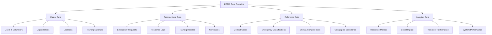
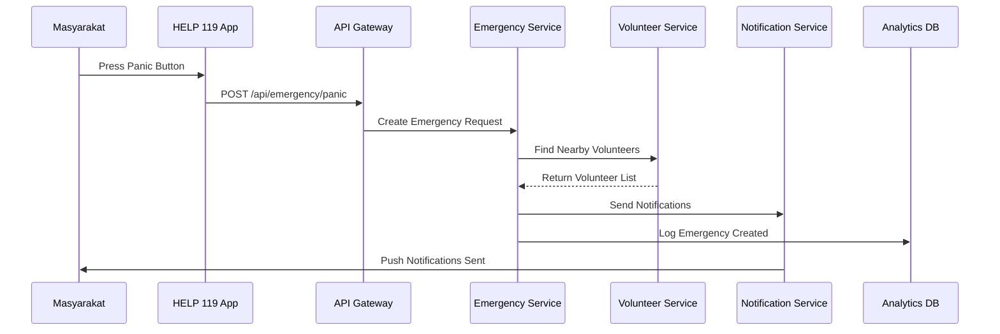
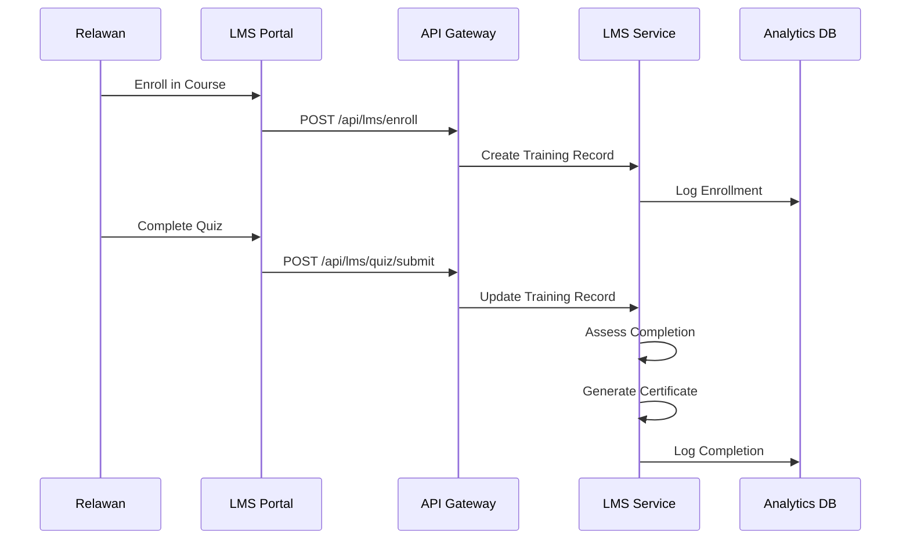

# Data Architecture KREKI

Data Architecture mengelola aset data KREKI sebagai sumber kebenaran tunggal yang mendukung operasi, analitik, dan keputusan strategis.

## Data Domain Model



---

## 1. Master Data

Data master adalah entitas core yang relatif statis dan digunakan cross-system.

### 1.1 Users & Volunteers

**Attributes:**
```yaml
User:
  - user_id: UUID (PK)
  - full_name: String
  - email: String (unique)
  - phone: String (unique)
  - role: Enum [public, volunteer, admin]
  - status: Enum [active, inactive, suspended]
  - created_at: Timestamp
  - updated_at: Timestamp

Volunteer (extends User):
  - volunteer_id: UUID (PK)
  - skills: Array[String]
  - certifications: Array[Certification]
  - location: GEOGRAPHY(Point)
  - availability_status: Enum [available, busy, offline]
  - bhd_cert_date: Date
  - bhd_expiry_date: Date
```

**Owner Service:** Auth Service / Volunteer Service

**Data Quality Rules:**
- Email & phone must be unique
- Location must be valid Indonesia coordinates
- BHD certificate must not be expired for active volunteers

### 1.2 Organizations

**Attributes:**
```yaml
Organization:
  - org_id: UUID (PK)
  - org_type: Enum [hospital, psc_119, bpbd, university, corporate, ngo]
  - name: String
  - parent_org_id: UUID (FK)
  - location: GEOGRAPHY(Point)
  - contact_person: String
  - contact_phone: String
  - integration_status: Enum [integrated, in_progress, not_integrated]
  - api_key_hash: String (for external integration)
```

**Owner Service:** Volunteer Service / SATUSEHAT Bridge

### 1.3 Locations (GIS Data)

**Attributes:**
```yaml
Location:
  - location_id: UUID (PK)
  - name: String
  - type: Enum [province, city, district, subdistrict, village]
  - parent_id: UUID (FK)
  - geometry: GEOGRAPHY(Polygon/MultiPolygon)
  - population: Integer
  - volunteer_count: Integer (denormalized for analytics)
```

**Owner Service:** Emergency Core Service (PostGIS database)

**Special Considerations:**
- Uses PostGIS for spatial queries
- Must align with Indonesian administrative boundaries (BPS)
- Volunteer density calculation uses this data

### 1.4 Training Materials

**Attributes:**
```yaml
TrainingMaterial:
  - material_id: UUID (PK)
  - title: String
  - type: Enum [video, document, quiz, interactive]
  - category: Enum [bhd_basic, bhd_plus, disaster, instructor]
  - difficulty_level: Enum [beginner, intermediate, advanced]
  - duration_minutes: Integer
  - url: String (CDN/S3)
  - version: Integer
  - is_active: Boolean
```

**Owner Service:** LMS Service

---

## 2. Transactional Data

Data transaksional mencatat operasi harian dan event-based.

### 2.1 Emergency Requests

**Attributes:**
```yaml
EmergencyRequest:
  - request_id: UUID (PK)
  - requester_id: UUID (FK → User)
  - location: GEOGRAPHY(Point)
  - severity: Enum [critical, urgent, normal]
  - status: Enum [pending, assigned, responding, completed, cancelled]
  - created_at: Timestamp
  - assigned_at: Timestamp
  - first_responded_at: Timestamp
  - arrived_at: Timestamp
  - completed_at: Timestamp
  - volunteer_ids: Array[UUID] (FK → Volunteer)
  - outcome: Enum [recovered, referred, deceased, unknown]
  - hospital_id: UUID (FK → Organization, nullable)
```

**Owner Service:** Emergency Core Service

**SLA Requirements:**
- Response time P95: < 5 seconds (volunteer notification)
- Data retention: 10 years (for impact analysis)

### 2.2 Response Logs

**Attributes:**
```yaml
ResponseLog:
  - log_id: UUID (PK)
  - emergency_id: UUID (FK → EmergencyRequest)
  - volunteer_id: UUID (FK → Volunteer)
  - action: Enum [accepted, rejected, arrived, completed]
  - timestamp: Timestamp
  - location: GEOGRAPHY(Point)
  - metadata: JSONB (notes, photos, etc.)
```

**Owner Service:** Emergency Core Service

### 2.3 Training Records

**Attributes:**
```yaml
TrainingRecord:
  - record_id: UUID (PK)
  - user_id: UUID (FK → User)
  - material_id: UUID (FK → TrainingMaterial)
  - enrollment_date: Timestamp
  - completion_date: Timestamp (nullable)
  - progress_percent: Integer
  - quiz_score: Integer (nullable)
  - status: Enum [enrolled, in_progress, completed, failed]
  - certificate_issued: Boolean
```

**Owner Service:** LMS Service

### 2.4 Certificates

**Attributes:**
```yaml
Certificate:
  - certificate_id: UUID (PK)
  - user_id: UUID (FK → User)
  - course_id: UUID (FK → TrainingMaterial)
  - issue_date: Date
  - expiry_date: Date
  - certificate_number: String (unique format: CERT-YYYY-NNNNNN)
  - qr_code_url: String
  - verification_status: Enum [valid, expired, revoked]
  - issuer_name: String
  - signature_data: String
```

**Owner Service:** LMS Service

---

## 3. Reference Data

Data referensi adalah data lookup/standar yang relatif stabil.

### 3.1 Medical Codes

**Sources:**
- ICD-10 (International Classification of Diseases)
- SNOMED CT (Systematized Nomenclature of Medicine)
- Local codes (Kemenkes)

**Sample Data:**
```yaml
EmergencyType:
  - code: "CARDIAC_ARREST"
  - display: "Cardiac Arrest"
  - category: "critical"
  - description: "Heart stops beating suddenly"

EmergencyType:
  - code: "SEVERE_BLEEDING"
  - display: "Severe Bleeding"
  - category: "urgent"
  - description: "Heavy blood loss from injury"
```

### 3.2 Emergency Classifications

```yaml
SeverityLevels:
  - level: "critical"
    description: "Life-threatening, immediate intervention required"
    response_target_seconds: 300  # 5 minutes

  - level: "urgent"
    description: "Serious but not immediately life-threatening"
    response_target_seconds: 600  # 10 minutes

  - level: "normal"
    description: "Non-critical, can wait"
    response_target_seconds: 1200  # 20 minutes
```

### 3.3 Skills & Competencies

```yaml
Skill:
  - skill_id: UUID
  - name: String (e.g., "BHD - RJP", "BHD - Tersedak")
  - category: Enum [bhd, disaster, instructor]
  - level: Enum [basic, intermediate, advanced]
  - assessment_required: Boolean
```

### 3.4 Geographic Boundaries

**Source:** BPS (Badan Pusat Statistik) Indonesia

**Hierarchy:**
```
Provinsi (34)
  └── Kabupaten/Kota (514)
      └── Kecamatan (7,000+)
          └── Kelurahan/Desa (83,000+)
```

---

## 4. Analytics Data

Data analitik adalah data teragregasi/tertransformasi untuk reporting dan insight.

### 4.1 Response Metrics

**Aggregations:**
```yaml
DailyResponseMetrics:
  - date: Date
  - total_emergencies: Integer
  - avg_response_time_seconds: Float
  - p95_response_time_seconds: Float
  - volunteer_response_rate: Float
  - successful_handoff_rate: Float
  - geographic_coverage_percent: Float
```

### 4.2 Social Impact

```yaml
MonthlyImpactMetrics:
  - month: Date
  - lives_saved: Integer
  - response_time_reduction_vs_baseline: Float (percent)
  - volunteer_count: Integer
  - geographic_coverage_kecamatan: Integer
  - community_trust_score: Float (survey)
```

### 4.3 Volunteer Performance

```yaml
VolunteerPerformance:
  - volunteer_id: UUID (FK)
  - month: Date
  - total_responses: Integer
  - acceptance_rate: Float
  - avg_response_time: Float
  - satisfaction_score: Float
  - badges_earned: Array[String]
```

### 4.4 System Performance

```yaml
SystemPerformanceMetrics:
  - date: Date
  - uptime_percentage: Float
  - api_response_time_p95: Float (ms)
  - error_rate: Float (percent)
  - concurrent_users_peak: Integer
  - database_query_time_p95: Float (ms)
```

---

## Data Flow Diagrams

### Emergency Response Data Flow



### Training Data Flow



---

## Data Governance Framework

### Data Stewardship

| Data Domain | Data Owner | Steward | Responsibilities |
|-------------|------------|---------|-----------------|
| Master Data | CTO | Data Architect | Data quality, standards, definitions |
| Emergency Data | Head of Ops | Ops Lead | Operational data integrity, SLA |
| Training Data | Head of Training | LMS Admin | Learning data accuracy, reporting |
| Analytics Data | CTO | Data Analyst | Aggregation rules, BI accuracy |

### Data Quality Rules

**Critical Data Quality Dimensions:**

| Dimension | Rule | Measurement |
|-----------|------|-------------|
| **Accuracy** | GPS location accuracy < 10m | PostGIS validation |
| **Completeness** | Required fields 100% populated | Database constraints |
| **Consistency** | Volunteer status sync across services | API verification |
| **Timeliness** | Emergency data persisted < 100ms | SLA monitoring |
| **Uniqueness** | No duplicate users/volunteers | Unique constraints |

### Data Privacy & Compliance

#### PDP Law 2022 Compliance

**Data Categories:**

| Category | Type | Consent Required | Retention |
|----------|------|------------------|-----------|
| **Health Data** | Sensitive | Explicit | 10 years |
| **Location Data** | Sensitive | Explicit | 2 years |
| **Personal Data** | Personal | Implicit | 5 years after inactive |
| **Public Data** | Public | None | Indefinite |

**Data Subject Rights:**
1. **Right to Access**: Users can request all their data
2. **Right to Rectification**: Users can correct inaccurate data
3. **Right to Erasure**: Users can request account deletion (with exceptions)
4. **Right to Portability**: Users can export their data
5. **Right to Object**: Users can object to processing

**Implementation:**
- Encryption at rest (PostgreSQL transparent encryption)
- Encryption in transit (TLS 1.3)
- Access logging (who accessed what data)
- Data anonymization for analytics (masking personal identifiers)

---

## Data Lifecycle Management

### Data Retention Policy

| Data Type | Retention Period | Archive | Purge |
|-----------|-----------------|---------|-------|
| Emergency requests | 10 years | Yes | After 10 years |
| Response logs | 2 years | No | After 2 years |
| Training records | 7 years | Yes | After 7 years |
| Certificates | Lifetime | Yes | On request |
| System logs | 90 days | Yes | After 90 days |
| Analytics aggregates | Indefinite | No | Never |

### Data Archival Strategy

**Hot Data (0-3 months):**
- Storage: Primary database (PostgreSQL)
- Access: Real-time queries

**Warm Data (3 months - 2 years):**
- Storage: Read replica or columnar store
- Access: Analytics queries

**Cold Data (> 2 years):**
- Storage: S3/Glacier with compression
- Access: Restore on request

---

## Data Integration Points

### External Data Exchange

| System | Direction | Protocol | Frequency | Data |
|--------|-----------|----------|-----------|------|
| **SATUSEHAT** | Bi-directional | FHIR R4 | Real-time | Patient, Practitioner |
| **PSC 119** | Bi-directional | REST/HL7 | Real-time | Emergency data |
| **Hospitals** | Bi-directional | FHIR/REST | Per emergency | Referral data |
| **BPJS Kesehatan** | Read | REST | Batch | Patient eligibility |

### Internal Data Sharing

| Service | Consumes From | Provides To |
|---------|---------------|-------------|
| **Auth Service** | - | User data to all services |
| **Emergency Core** | Auth, Volunteer | Response data to Analytics |
| **LMS** | Auth | Training data to Volunteer |
| **Notification** | Emergency | Delivery status to Emergency |
| **SATUSEHAT Bridge** | Emergency | FHIR resources to external |

---

## Technology Stack for Data

| Component | Technology | Purpose |
|-----------|------------|---------|
| **Primary Database** | PostgreSQL + PostGIS | OLTP, spatial queries |
| **Cache** | Redis | Session, frequently accessed data |
| **Analytics DB** | PostgreSQL (columnar extension) | OLAP, aggregations |
| **Data Warehouse** | (Future) BigQuery / Redshift | Long-term analytics |
| **Search** | (Future) Elasticsearch | Full-text search on logs |
| **Message Queue** | RabbitMQ | Data streaming between services |
| **Data Pipeline** | (Future) Apache Airflow | ETL/ELT processes |

---

## Related Documentation

- [System Architecture](../architecture/system-architecture.md) - Database per service pattern
- [Microservices Design](../architecture/microservices-design.md) - Data models per service
- [Security Architecture](./security-architecture.md) - Data encryption & access control
- [IT Governance](../governance/it-governance.md) - Data governance framework

---

*Kembali ke [Enterprise Architecture](./index.md)*
