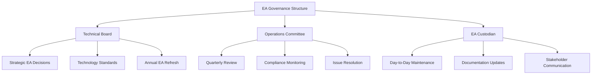
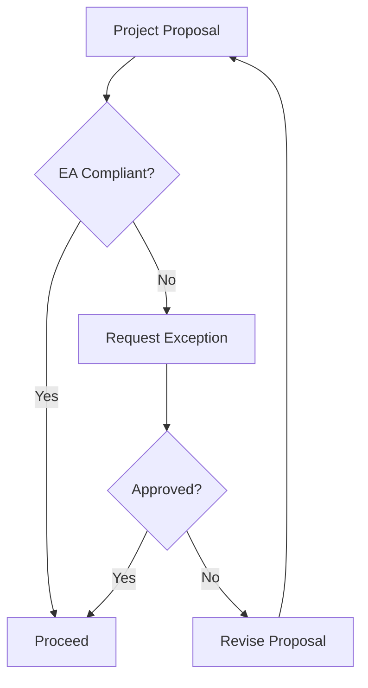

# EA Governance KREKI

EA Governance mendefinisikan bagaimana Enterprise Architecture KREKI dikelola, diperbarui, dan dipatuhi untuk memastikan EA tetap relevan dan efektif.

## Governance Structure



---

## 1. Governance Bodies

### 1.1 Technical Board

**Purpose:** Strategic decision-making untuk architecture dan technology.

**Composition:**
| Role | Name | Responsibilities |
|------|------|------------------|
| **Chair** | CTO/Lead Architect | Facilitate meetings, final decisions |
| **Member** | Head of Engineering | Technical feasibility input |
| **Member** | Data Architect | Data architecture input |
| **Member** | Security Lead | Security requirements input |
| **Member** | Product Manager | Business requirements input |
| **Advisor** | External (Academic/Industry) | Industry perspective, best practices |

**Meeting Cadence:** Quarterly

**Responsibilities:**
- Approve major architecture changes
- Establish technology standards
- Review EA annually and approve updates
- Resolve escalated EA issues
- Approve technology radar updates

**Decision Making:**
- Consensus preferred
- Majority vote if consensus not reached
- Chair has tie-breaking vote

### 1.2 Operations Committee

**Purpose:** Daily operational coordination dan EA compliance.

**Composition:**
| Role | Responsibilities |
|------|------------------|
| **DevOps Lead** | Infrastructure compliance |
| **Service Owners** | Service-level EA compliance |
| **On-call Engineer** | Operational issues |
| **QA Lead** | Testing compliance |

**Meeting Cadence:** Weekly

**Responsibilities:**
- Monitor EA compliance in operations
- Coordinate EA-related changes
- Review EA compliance incidents
- Report to Technical Board quarterly

### 1.3 EA Custodian

**Role:** Lead Architect or designated EA owner

**Responsibilities:**
- Maintain EA documentation
- Facilitate EA reviews
- Coordinate EA updates
- Manage EA tools and repositories
- Communicate EA changes to stakeholders

**Time Allocation:** 20-30% of time

---

## 2. EA Update Cycle

### 2.1 Quarterly Review

**Purpose:** Review EA updates, address issues, update technology radar.

**Schedule:**
- Q1 Review: January
- Q2 Review: April
- Q3 Review: July
- Q4 Review: October

**Agenda:**
1. Review changes since last review
2. Update technology radar (ADOPT/TRIAL/ASSESS/HOLD)
3. Address EA compliance issues
4. Review pilot projects from Innovation Framework
5. Plan next quarter priorities

**Participants:** Technical Board, EA Custodian, Service Owners

**Outputs:**
- Updated technology radar
- EA change recommendations
- Pilot project decisions

### 2.2 Annual Refresh

**Purpose:** Comprehensive EA refresh untuk tahun berikutnya.

**Schedule:** November-December

**Activities:**
1. Review all EA domains
2. Assess architecture maturity
3. Identify gaps and improvement areas
4. Update EA targets for next year
5. Align with organizational strategy
6. Publish updated EA documentation

**Participants:** Technical Board, Operations Committee, Stakeholders

**Outputs:**
- Updated EA documentation (all domains)
- EA maturity assessment
- EA roadmap for next year
- EA metrics and KPIs

---

## 3. EA Compliance

### 3.1 Compliance Requirements

**Mandatory Compliance:**
- New projects must align with EA
- Technology choices must follow Technology Radar
- Architecture decisions must be documented
- Exceptions must be approved

**Voluntary Compliance:**
- Legacy systems encouraged to align
- Best practices from EA recommended

### 3.2 Compliance Process

**For New Projects:**



**Exception Request Process:**

1. **Propose:** Submit exception request with rationale
2. **Review:** Operations Committee reviews
3. **Decision:** Approve/reject within 5 business days
4. **Conditions:** May impose conditions for approval
5. **Document:** Record exception and rationale

**Exception Criteria:**
- Critical business need
- Technical constraint beyond control
- Timeline pressure (temporary exception)
- Cost-prohibitive to comply

### 3.3 Compliance Monitoring

**Automated Checks:**
- Infrastructure as Code compliance (Terraform scans)
- Dependency compliance (Snyk, npm audit)
- API standards compliance (Swagger validation)

**Manual Reviews:**
- Architecture decision records (ADR) reviews
- Design reviews for major changes
- Post-implementation reviews

**Metrics:**

| Metric | Target | Measurement |
|--------|--------|-------------|
| EA Compliance Rate | > 95% | % of projects compliant |
| Exception Approval Rate | < 10% | % of exceptions approved |
| EA Documentation Currency | 100% | All docs updated in annual refresh |

---

## 4. EA Documentation Standards

### 4.1 Documentation Principles

**Principles:**
1. **Living Documents:** Always up-to-date
2. **Version Control:** All changes tracked in Git
3. **Peer Review:** Major changes reviewed before merge
4. **Accessibility:** Easy to find and understand
5. **Consistency:** Uniform format and style

### 4.2 Documentation Format

**Frontmatter:**
```yaml
---
title: "Document Title"
description: "Brief description"
category: "enterprise-architecture"
last_updated: YYYY-MM-DD
version: "1.0.0"
---
```

**Style Guidelines:**
- Use Indonesian for user-facing content
- Use English for technical terms
- Use Mermaid for diagrams
- Use tables for structured data
- Use code blocks for examples

### 4.3 Documentation Review

**Review Triggers:**
- Annual EA refresh
- Major architecture changes
- Technology radar updates
- Stakeholder feedback

**Review Process:**
1. EA Custodian initiates review
2. Stakeholders provide feedback
3. Technical Board approves updates
4. Documentation updated
5. Changes communicated

---

## 5. EA Tools & Repositories

### 5.1 Tools

| Tool | Purpose | Status |
|------|---------|--------|
| **Git/GitHub** | Version control, collaboration | ✅ Active |
| **Mermaid** | Diagram visualization | ✅ Active |
| **Swagger/OpenAPI** | API documentation | ✅ Active |
| **Confluence/Notion** | Knowledge base (alternative) | 🚧 Evaluating |
| **ADR Tools** | Architecture Decision Records | 🚧 Future |

### 5.2 Repositories

**Primary Repository:**
- GitHub: https://github.com/ahidayatxx/KREKI
- Path: `/docs/ea/`

**Documentation Structure:**
```
docs/ea/
├── index.md                    # EA overview
├── business-architecture.md     # Business capabilities
├── data-architecture.md         # Data domains
├── application-architecture.md   # Application portfolio
├── technology-architecture.md    # Technology stack
├── security-architecture.md     # Security domains
├── integration-architecture.md   # Integration patterns
├── innovation-framework.md      # Technology radar
├── ea-governance.md             # This file
└── roadmap.md                   # EA evolution
```

---

## 6. EA Communication Strategy

### 6.1 Internal Communication

**Audiences:**

| Audience | Content | Frequency | Channel |
|-----------|---------|-----------|---------|
| **Technical Board** | Strategic updates, decisions | Quarterly | Meeting + Email |
| **Developers** | Technology standards, best practices | Monthly | Tech talk, Slack |
| **Management** | EA metrics, compliance status | Quarterly | Dashboard, Report |
| **All Staff** | EA overview, updates | Annually | All-hands, Email |

### 6.2 External Communication

**Audiences:**

| Audience | Content | Frequency | Channel |
|-----------|---------|-----------|---------|
| **Partners** | Integration standards, APIs | On request | Documentation, Portal |
| **Donors** | Technology impact, transparency | Annually | Annual Report |
| **Public** | Technology innovation, impact | Quarterly | Blog, Social Media |
| **Academia** | Research publications, case studies | As needed | Papers, Conferences |

### 6.3 Feedback Channels

**Internal Feedback:**
- EA feedback email: ea-feedback@kreki.or.id
- GitHub issues (for documentation)
- Slack channel (#ea-discussions)
- Quarterly survey (all staff)

**External Feedback:**
- Partner feedback meetings
- User feedback (via app, surveys)
- Public comments (GitHub issues for open docs)

---

## 7. EA Metrics & KPIs

### 7.1 EA Health Metrics

| Metric | Target | Measurement | Frequency |
|--------|--------|-------------|-----------|
| **EA Coverage** | 100% of domains documented | % of domains with docs | Quarterly |
| **Documentation Currency** | All docs < 6 months old | % of docs updated | Quarterly |
| **Stakeholder Awareness** | > 80% | Survey results | Annually |
| **EA Utilization** | > 90% projects consult EA | % of projects referencing EA | Quarterly |

### 7.2 Compliance Metrics

| Metric | Target | Measurement | Frequency |
|--------|--------|-------------|-----------|
| **Compliance Rate** | > 95% | % of compliant projects | Quarterly |
| **Exception Rate** | < 10% | % of exceptions requested | Quarterly |
| **Exception Approval Rate** | < 50% | % of exceptions approved | Quarterly |

### 7.3 Innovation Metrics

| Metric | Target | Measurement | Frequency |
|--------|--------|-------------|-----------|
| **Pilot Projects** | 2-4 per year | Count of active pilots | Quarterly |
| **Technology Adoption** | 1-2 per quarter | New technologies adopted | Quarterly |
| **Innovation Success Rate** | > 50% | % of pilots scaled | Annually |

---

## 8. EA Roles & Responsibilities

### 8.1 Technical Board Roles

| Role | Responsibilities | Time Commitment |
|------|------------------|------------------|
| **Chair** | Facilitate, decide, communicate | 4 hours/quarter |
| **Member** | Review, advise, vote | 2 hours/quarter |
| **Advisor** | Provide external perspective | 2 hours/quarter |

### 8.2 EA Custodian Roles

| Responsibility | Description | Frequency |
|----------------|-------------|-----------|
| **Documentation Maintenance** | Update EA docs | As needed |
| **Review Coordination** | Facilitate quarterly review | Quarterly |
| **Stakeholder Communication** | Share EA updates | Quarterly |
| **Compliance Monitoring** | Track EA compliance | Monthly |
| **Issue Resolution** | Address EA issues | As needed |

### 8.3 Service Owner Roles

| Responsibility | Description | Frequency |
|----------------|-------------|-----------|
| **Service Alignment** | Ensure service aligns with EA | Ongoing |
| **Exception Requests** | Request exceptions when needed | As needed |
| **Feedback** | Provide feedback on EA | Quarterly |
| **Compliance Reporting** | Report compliance status | Quarterly |

---

## 9. EA Maturity Model

KREKI EA maturity progression:

### Level 1: Initial (Current State)
- EA documentation exists
- Basic governance structure
- Technology radar established
- Partial compliance monitoring

### Level 2: Developing (Target: 2025)
- Quarterly review process
- Exception process formalized
- Metrics and KPIs defined
- Stakeholder communication plan

### Level 3: Defined (Target: 2026)
- Full compliance monitoring
- Automated compliance checks
- Comprehensive metrics dashboard
- Regular stakeholder feedback loops

### Level 4: Managed (Target: 2027)
- EA-driven investment decisions
- Continuous improvement process
- Innovation pipeline active
- EA value quantified

### Level 5: Optimizing (Target: 2028+)
- EA is competitive advantage
- Predictive architecture planning
- Industry benchmarking
- Thought leadership

---

## Related Documentation

- [EA Roadmap](./roadmap.md) - EA evolution timeline
- [IT Governance](../governance/it-governance.md) - IT governance framework
- [Technology Architecture](./technology-architecture.md) - Technology standards

---

*Kembali ke [Enterprise Architecture](./index.md)*
