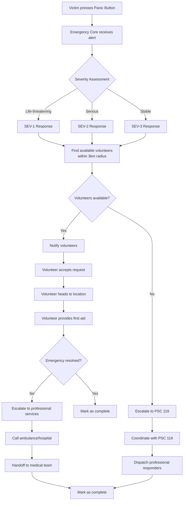

# Emergency Response Playbook

This document provides the complete end-to-end workflow for emergency response operations in the KREKI ecosystem. It defines the business process flow from panic button activation to medical intervention completion.

## Overview

**Purpose:** To ensure every emergency request receives a timely, coordinated, and effective response from KREKI volunteers and professional healthcare services.

**Scope:** This playbook covers all emergency scenarios handled through the HELP 119 application, including medical emergencies, accidents, and health crises.

---

## Emergency Response Workflow

### End-to-End Flow



---

## Emergency Scenarios & Response Protocols

### Scenario 1: Cardiac Arrest (SEV-1 - Critical)

**Trigger:** Panic button pressed for cardiac arrest

**Response Protocol:**

1. **Immediate Response (0-30 seconds)**
   - Emergency Core processes panic button location
   - System searches for available volunteers within 3km
   - Push notifications sent to all nearby volunteers
   - SMS/WhatsApp backup notifications sent

2. **Volunteer Dispatch (30 seconds - 2 minutes)**
   - First volunteer to accept is designated as Team Lead
   - Additional volunteers summoned if available
   - Volunteer receives:
     - Victim location (GPS coordinates)
     - Victim基本信息 (age, gender, medical history if available)
     - AI-powered first aid instructions via phone

3. **On-Scene Intervention (2-15 minutes)**
   - Volunteer arrives and assesses victim condition
   - Initiates CPR (Cardiopulmonary Resuscitation) if needed
   - Follows AI voice guidance for specific interventions
   - Notifies Emergency Core: "Arrived on scene, beginning CPR"

4. **Professional Escalation (if needed)**
   - If no response after 5 minutes of CPR → Call PSC 119
   - If AED available → Use AED and continue CPR
   - Ambulance dispatch through PSC 119 integration

5. **Handoff to Medical Team**
   - Volunteer provides summary of interventions
   - Reports time elapsed since cardiac arrest
   - Hands over to paramedics/medical team

6. **Completion**
   - Emergency marked as resolved
   - Volunteer submits incident report
   - System logs: Total response time, interventions, outcome

---

### Scenario 2: Traffic Accident (SEV-1 - Critical)

**Trigger:** Panic button for traffic accident with injuries

**Response Protocol:**

1. **Immediate Response**
   - Locate victim via GPS
   - Dispatch available volunteers within 3km
   - Notify PSC 119 simultaneously (requires professional extraction/ambulance)

2. **Volunteer Actions**
   - Secure accident scene (safety first)
   - Assess victims (triage: red/yellow/green)
   - Provide basic first aid for bleeding control
   - Do NOT move victims unless immediate danger

3. **Coordination with PSC 119**
   - Report accident severity
   - Request ambulance(s) based on victim count
   - Coordinate with police if needed (PSC 119 will handle)

4. **Professional Handoff**
   - Volunteer provides triage summary to paramedics
   - Reports all interventions performed
   - Hands over scene to authorities

---

### Scenario 3: Difficulty Breathing (SEV-2 - Serious)

**Trigger:** Panic button for breathing difficulty

**Response Protocol:**

1. **Dispatch**
   - Find volunteers within 3km
   - Prioritize volunteers with medical training

2. **On-Scene Assessment**
   - Check airway, breathing, circulation
   - Position victim for optimal breathing
   - Monitor vital signs

3. **Decision Tree**

```
Is breathing improving?
├── Yes → Monitor and wait
└── No → Escalate to PSC 119
         → Call ambulance
         → Continue monitoring
```

---

## Volunteer Roles & Responsibilities

### First Responder (Team Lead)

**Responsibilities:**
- First to arrive on scene
- Assumes command until professional services arrive
- Coordinates other volunteers
- Makes critical decisions (escalation, CPR initiation)
- Communicates with Emergency Core

**Requirements:**
- Certified in Basic Life Support (BHD Plus)
- Completed KREKI practical training
- Status: Available and verified

### Supporting Volunteer

**Responsibilities:**
- Assists Team Lead
- Manages crowd/bystanders
- Fetches equipment (AED, first aid kit)
- Documents interventions (photos/video if appropriate)

### Volunteer Coordinator (Remote)

**Responsibilities:**
- Monitors multiple emergency requests
- Ensures adequate volunteer coverage
- Coordinates with PSC 119 for escalation
- Updates emergency status in system

---

## Escalation Procedures

### When to Escalate to PSC 119

**Immediate Escalation (SEV-1):**
- Cardiac arrest with no response after 5 minutes CPR
- Severe bleeding uncontrolled
- Unconsciousness not improving
- Multiple casualties (3+ victims)

**Urgent Escalation (SEV-2):**
- Difficulty breathing worsening
- Chest pain with suspected heart attack
- Possible stroke symptoms (FAST positive)
- Fractures that immobilize victim

**Consultation (SEV-3):**
- Minor injuries with uncertain severity
- Victim request for professional medical attention

### Escalation Workflow

```
1. Volunteer identifies need for escalation
   ↓
2. Volunteer taps "Escalate to PSC 119" in app
   ↓
3. Emergency Core opens PSC 119 communication channel
   ↓
4. Volunteer provides situation report (SITREP):
   - Location and type of emergency
   - Victim condition
   - Interventions performed
   - Current status
   ↓
5. PSC 119 dispatches appropriate services
   ↓
6. Volunteer maintains scene until handoff
```

---

## Communication Protocols

### Volunteer ↔ Emergency Core

| Status | Trigger | Message |
|--------|---------|---------|
| **Accepted** | Volunteer accepts request | "En route to {location}" |
| **Arrived** | Volunteer reaches victim | "On scene, assessing {victim_type}" |
| **Intervention** | Providing care | "Performing {intervention}, condition {status}" |
| **Escalating** | Need professional help | "Escalating to PSC 119, reason: {reason}" |
| **Resolved** | Emergency complete | "Emergency resolved, handing over" |

### Emergency Core ↔ PSC 119

| Event | Data Transmitted |
|-------|-----------------|
| **Initial Alert** | Emergency ID, location, type, severity |
| **Update** | Volunteer on scene, current status |
| **Escalation** | SITREP, requested resources |
| **Handoff** | Volunteer report, victim destination |

---

## Post-Emergency Procedures

### For Volunteers

**Immediately After Emergency:**
1. Complete incident report in app (within 1 hour)
2. Report:
   - Time spent on scene
   - Interventions performed
   - Supplies used (if any)
   - Victim outcome (if known)
   - Emotional state (for follow-up if needed)

**Debrief (for SEV-1 incidents):**
- Required for all critical incidents
- Virtual debrief within 48 hours
- Focus on: What went well, what could be improved

### For Emergency Core

**After Each Emergency:**
1. Log complete timeline (button press to resolution)
2. Update volunteer status
3. Track metrics:
   - Response time (button to volunteer arrival)
   - Resolution time
   - Escalation rate
   - Volunteer satisfaction

**Weekly Review:**
- Analyze trends in emergency types
- Identify training needs
- Review escalations (were they appropriate?)

---

## Quality Assurance

### Response Time Targets

| Metric | Target | Measurement |
|--------|--------|-------------|
| **Button to Volunteer Acceptance** | < 2 minutes | Emergency Core logs |
| **Volunteer Arrival** | < 8 minutes (urban), < 15 minutes (rural) | GPS timestamps |
| **PSC 119 Escalation** | < 30 seconds from request | System logs |

### Performance Indicators

| Indicator | Good Performance | Needs Improvement |
|-----------|------------------|-------------------|
| **Volunteer Acceptance Rate** | > 80% | < 50% |
| **Escalation Appropriateness** | > 90% appropriate | < 70% appropriate |
| **Volunteer Satisfaction** | Positive | Negative/burnout risk |
| **Victim Outcome** | Improved/stabilized | Deteriorated |

---

## Special Situations

### Multiple Concurrent Emergencies

**Protocol:**
1. Emergency Core prioritizes by SEV level
2. SEV-1 > SEV-2 > SEV-3
3. Within same SEV level: nearest first

**Volunteer Allocation:**
- System suggests optimal volunteer distribution
- Volunteers can only handle one emergency at a time
- Volunteer Coordinator can manually reassign

### Natural Disaster

**Protocol:**
1. Activate Disaster Response Mode
2. Multiple volunteer dispatch per emergency
3. Integration with BPBD (Regional Disaster Management Agency)
4. Special escalation procedures

---

## Related Documentation

- [Incident Management](../incident-management.md) - Technical incident procedures
- [Microservices Design](../microservices-design.md) - Emergency Core service specifications
- [Contributing Guide](../contribution-guide.md) - Volunteer certification requirements

---

*Kembali ke [Governance](./index.md)*
