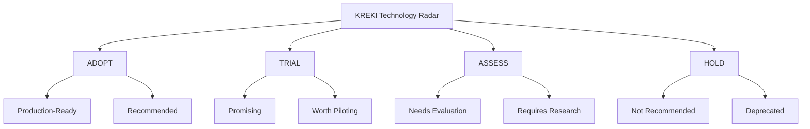

# Innovation Framework KREKI

Innovation Framework mendefinisikan bagaimana KREKI mengantisipasi dan mengadopsi teknologi baru untuk tetap relevan dan kompetitif dalam misi menyelamatkan nyawa.

## Technology Radar

Technology Radar adalah alat untuk memetakan teknologi ke 4 kuadran berdasarkan kesiapan adopsi:

---

## 1. ADOPT - Production-Ready

Teknologi yang terbukti, stabil, dan direkomendasikan untuk penggunaan produksi luas.

### Frontend & Mobile

| Technology | Maturity | Use Case | Risk |
|------------|----------|----------|------|
| **Flutter** | High | Mobile cross-platform | Low |
| **React.js** | High | Web applications | Low |
| **Tailwind CSS** | High | UI styling | Low |
| **Vue.js** | High | Lightweight web apps | Low |

### Backend & Services

| Technology | Maturity | Use Case | Risk |
|------------|----------|----------|------|
| **Node.js** | High | API services | Low |
| **Go** | High | High-performance services | Low |
| **Python** | High | Analytics, ML | Low |
| **PostgreSQL** | High | Primary database | Low |
| **PostGIS** | High | Geospatial queries | Low |
| **Redis** | High | Caching | Low |

### Infrastructure

| Technology | Maturity | Use Case | Risk |
|------------|----------|----------|------|
| **Docker** | High | Containerization | Low |
| **Docker Swarm** | Medium | Container orchestration | Low |
| **AWS** | High | Cloud provider | Medium (vendor lock-in) |
| **Kong** | High | API Gateway | Low |
| **Cloudflare** | High | CDN, security | Low |

### Integration

| Technology | Maturity | Use Case | Risk |
|------------|----------|----------|------|
| **REST API** | High | Standard integration | Low |
| **FHIR R4** | High | Healthcare data exchange | Low |
| **RabbitMQ** | High | Message queuing | Low |
| **WebSockets** | High | Real-time communication | Low |

---

## 2. TRIAL - Worth Piloting

Teknologi menjanjikan yang layak diuji dalam proyek pilot atau skala kecil sebelum adopsi penuh.

### Frontend & Mobile

| Technology | Potential | Pilot Use Case | Success Criteria |
|------------|-----------|----------------|------------------|
| **Next.js** | High | SEO-critical pages | Improved SEO, faster load |
| **GraphQL** | Medium | Complex data queries | Reduced API calls |
| **Progressive Web App (PWA)** | High | Offline mobile access | Works offline on low connectivity |

### Backend & Services

| Technology | Potential | Pilot Use Case | Success Criteria |
|------------|-----------|----------------|------------------|
| **Fastify** | Medium | High-performance API | < 100ms response time |
| **gRPC** | High | Inter-service communication | 2x faster than REST |
| **Laravel** | Medium | LMS with admin panel | Faster development for PHP devs |
| **Elasticsearch** | High | Full-text search (logs, documents) | < 100ms search response |

### Infrastructure

| Technology | Potential | Pilot Use Case | Success Criteria |
|------------|-----------|----------------|------------------|
| **Kubernetes** | Medium | Large-scale deployment | Manages 50+ containers efficiently |
| **Terraform** | High | Infrastructure as Code | Reproducible deployments |
| **AWS Fargate** | Medium | Serverless containers | 30% cost reduction |

### Analytics & ML

| Technology | Potential | Pilot Use Case | Success Criteria |
|------------|-----------|----------------|------------------|
| **Apache Airflow** | High | Data pipeline orchestration | Automated data workflows |
| **dbt** | Medium | Data transformation | Version-controlled data models |
| **TensorFlow Lite** | Medium | On-device ML (triage assistance) | < 500ms inference time |
| **Scikit-learn** | High | Dispatch optimization model | 20% improvement in response time |

### Emerging Features

| Feature | Potential | Pilot Use Case | Success Criteria |
|---------|-----------|----------------|------------------|
| **Event-Driven Architecture** | High | Emergency notification system | Decoupled services, real-time updates |
| **Offline-First Mobile** | High | HELP 119 app in rural areas | Works without internet for 24h |
| **ML-Based Dispatch** | High | Volunteer matching algorithm | 15% faster volunteer arrival |

---

## 3. ASSESS - Needs Evaluation

Teknologi yang menarik tetapi memerlukan evaluasi lebih lanjut untuk memahami manfaat dan risikonya.

### Frontend & Mobile

| Technology | Pros | Cons | Evaluation Questions |
|------------|------|------|---------------------|
| **React Native** | Large ecosystem | Flutter better for KREKI? | Performance comparison? |
| **Angular** | Enterprise features | Steep learning curve, declining | Talent availability? |
| **Svelte** | Smaller bundle size | Smaller ecosystem | Long-term viability? |

### Backend & Services

| Technology | Pros | Cons | Evaluation Questions |
|------------|------|------|---------------------|
| **Kubernetes** | Industry standard | Complex setup, overkill? | At what scale does K8s justify overhead? |
| **Java/Spring Boot** | Enterprise adoption | Verbosity, slower development | Performance vs complexity trade-off? |
| **.NET Core** | Microsoft ecosystem | Less common in startups | Azure partnership opportunities? |
| **Cassandra** | Scalable NoSQL | Complex operations | Do we need this scale? |

### Infrastructure

| Technology | Pros | Cons | Evaluation Questions |
|------------|------|------|---------------------|
| **Google Cloud Platform** | Strong data/analytics | AWS has more Indonesia presence | BigQuery vs Redshift cost? |
| **AliCloud** | Cost-effective | Less familiar | How to handle vendor lock-in? |
| **DigitalOcean** | Simple, affordable | Limited enterprise features | For non-critical services only? |

### Blockchain & Web3

| Technology | Potential Use Case | Pros | Cons |
|------------|-------------------|------|------|
| **Blockchain Credential Verification** | Verify BHD certificates | Tamper-proof, decentralized | Complexity, cost |
| **Smart Contracts** | Automated donor funds disbursement | Transparent, auditable | Gas fees, complexity |
| **NFTs** | Fundraising, donor recognition | Novelty, engagement | Environmental concerns |

---

## 4. HOLD - Not Recommended

Teknologi yang tidak direkomendasikan untuk penggunaan baru karena sudah usang, terlalu berisiko, atau tidak relevan.

### Deprecated Technologies

| Technology | Reason | Alternative |
|------------|--------|-------------|
| **jQuery** | Outdated, not needed with modern frameworks | React, Vue, vanilla JS |
| **Bootstrap** | Outdated design patterns | Tailwind CSS |
| **Angular.js (v1.x)** | End of life | React, Vue, Angular (v2+) |
| **SOAP** | Legacy, complex | REST, FHIR |
| **XML** | JSON preferred | JSON |
| **Monolithic Architecture** | Against microservices | Microservices |
| **On-Premise Only** | No cloud benefit | Hybrid cloud |
| **Manual Server Setup** | Not reproducible | Docker, Terraform |

### Practices to Avoid

| Practice | Risk | Alternative |
|----------|-------|-------------|
| **Hardcoded Secrets** | Security breach | Secret management |
| **No Monitoring** | Operational blindness | Comprehensive monitoring |
| **Manual Deployments** | Error-prone | CI/CD automation |
| **Synchronous-Only Integrations** | Not resilient | Async messaging |
| **Single Cloud Provider** | Vendor lock-in | Multi-cloud |

---

## Emerging Technology Watchlist

### 1-2 Years (Near-term)

Teknologi yang mungkin relevan dalam 1-2 tahun ke depan:

| Technology | Potential Impact | Use Case | Readiness |
|------------|-----------------|----------|----------|
| **5G Networks** | High | Real-time emergency video consultation | Growing in Indonesia |
| **Edge Computing** | High | Reduce latency for critical services | Early adoption |
| **Digital Health Passports** | Medium | Verify volunteer credentials | Standards emerging |
| **Voice AI (NLP)** | Medium | Voice-activated emergency calls | Tech ready, integration needed |
| **Computer Vision** | Medium | Auto-assess injury severity from photos | Improving rapidly |

### 2-5 Years (Mid-term)

Teknologi yang mungkin relevan dalam 2-5 tahun ke depan:

| Technology | Potential Impact | Use Case | Uncertainty |
|------------|-----------------|----------|------------|
| **AI/ML Triage Assistance** | High | Help volunteers assess severity | Regulatory approval needed |
| **IoT Smart Devices** | Medium | Wearables detect falls/emergencies | Hardware costs dropping |
| **Augmented Reality (AR)** | Medium | Guide volunteers through procedures | Hardware adoption |
| **Autonomous Drones** | High | Deliver AED to emergency location | Regulations unclear |
| **Quantum Computing** | Low | Optimize large-scale disaster response | Speculative |

### 5+ Years (Long-term)

Teknologi spekulatif yang mungkin relevan dalam 5+ tahun:

| Technology | Potential Impact | Use Case | Speculation |
|------------|-----------------|----------|-------------|
| **Brain-Computer Interfaces** | Low | Direct emergency notification | Very early research |
| **Nanotechnology** | Medium | Smart wound care, drug delivery | Early research |
| **6G Networks** | High | Ultra-low latency emergency response | Standards not defined |
| **Synthetic Biology** | Low | Smart biomarkers for health monitoring | Fundamental research |

---

## Innovation Pipeline

### Stage 1: Ideation

**Source of Ideas:**
- Volunteer feedback
- Technology trends (Conferences, blogs, research)
- Partner suggestions
- Competitor analysis
- Hackathons, innovation challenges

**Capture Method:**
- Innovation backlog (GitHub issues)
- Quarterly brainstorming sessions
- Technology radar reviews

### Stage 2: Assessment

**Evaluation Criteria:**

| Criterion | Weight | Questions |
|-----------|--------|-----------|
| **Alignment with Mission** | High | Does this help save lives? |
| **Technical Feasibility** | High | Can we build this? |
| **Business Value** | High | What's the ROI? |
| **Resource Requirements** | Medium | Cost, time, expertise? |
| **Risk** | Medium | Security, privacy, regulatory? |
| **Scalability** | Medium | Can it scale nationally? |

**Output:** Go/No-Go decision with rationale

### Stage 3: Piloting

**Pilot Design:**
- Clear success criteria
- 3-6 month timeline
- Limited scope (geographic or user segment)
- Metrics tracking

**Pilot Examples:**
| Idea | Pilot Scope | Success Criteria |
|------|-------------|------------------|
| **Offline-First Mobile** | 1 province, 100 volunteers | 80% tasks work offline |
| **ML Dispatch Optimization** | 50 emergencies | 15% faster response |
| **Voice Emergency Calls** | Internal testing | < 5s transcription |
| **PWA** | Android beta | Works offline 24h |

### Stage 4: Evaluation

**Pilot Review:**
- Metrics achieved?
- User feedback positive?
- Technical issues resolved?
- Cost acceptable?
- Scalability proven?

**Decision:**
- **Scale:** Roll out nationally
- **Iterate:** Run another pilot with improvements
- **Hold:** Pause, revisit in 6 months
- **Cancel:** Terminate, document learnings

### Stage 5: Scale

**Scaling Checklist:**
- [ ] Success criteria met
- [ ] Technical issues resolved
- [ ] Documentation complete
- [ ] Team trained
- [ ] Support processes ready
- [ ] Monitoring in place
- [ ] Rollback plan defined

---

## Partnership Innovation

KREKI berinovasi melalui kemitraan dengan:

### Academic Partners

| University | Collaboration Area | Status |
|------------|-------------------|--------|
| **UGM, UI, ITB** | Research, volunteer pipeline | Active |
| **Binus, Tel-U** | Student projects, internships | Exploring |
| **Foreign Universities** | Research collaboration, grants | Future |

### Startup Partnerships

| Startup Type | Collaboration Area | Examples |
|---------------|-------------------|----------|
| **Health Tech** | Integration, pilots | Alodokter, Halodoc (models) |
| **AI/ML** | Algorithm development | Local AI startups |
| **Mobile** | App development | Local app dev shops |

### Corporate Innovation

| Company | Collaboration Area | Status |
|----------|-------------------|--------|
| **Tech Companies** | Cloud credits, expertise | AWS Activate, Google for Nonprofits |
| **Telcos** | 5G trials, connectivity | Exploring |
| **Device Manufacturers** | Device donations | Future |

---

## Innovation Governance

### Innovation Board

**Purpose:** Review and approve innovation proposals

**Composition:**
- CTO (Chair)
- Head of Product
- Lead Architect
- External advisor (academic or industry)

**Cadence:** Quarterly meetings

**Responsibilities:**
- Review technology radar
- Approve pilots
- Evaluate pilot results
- Make scale/hold/cancel decisions

### Innovation Budget

**Allocation:**
- 10% of engineering time for experiments
- 5% of IT budget for tools/training
- Dedicated innovation fund (grants, partnerships)

**Funding Sources:**
- Operational budget
- Grants (innovation, research)
- Corporate sponsorships
- International donor funding

---

## Learning & Development

### Technology Awareness

**Activities:**
- Quarterly tech talks (internal/external speakers)
- Conference attendance (local, international)
- Research paper reviews
- Technology radar updates

**Target:**
- All engineers: 4 hours/month learning time
- Architects: 8 hours/month research time
- CTO: 16 hours/month strategic thinking

### Experimentation Culture

**Principles:**
- Fail fast, learn faster
- Document experiments
- Share learnings
- No blame for failed pilots

**Recognition:**
- Innovation awards (quarterly)
- Hackathon prizes
- Conference presentations
- Paper publications

---

## Related Documentation

- [Technology Architecture](./technology-architecture.md) - Current technology stack
- [EA Roadmap](./roadmap.md) - Innovation timeline
- [IT Governance](../governance/it-governance.md) - Change management

---

*Kembali ke [Enterprise Architecture](./index.md)*
