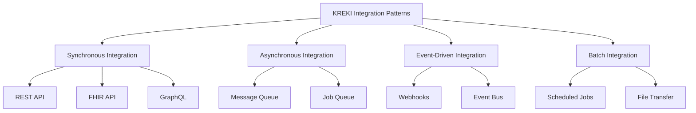

# Integration Architecture KREKI

Integration Architecture mendefinisikan pola integrasi, standar, dan katalog integrasi eksternal untuk menghubungkan ekosistem digital KREKI dengan stakeholder.

## Integration Patterns Overview



---

## 1. Integration Patterns

### 1.1 Synchronous Integration (REST API)

**Use Case:** Request-response yang memerlukan hasil segera

**Characteristics:**
- Caller waits for response
- Real-time validation
- Tight coupling (caller depends on callee)

**Examples in KREKI:**
- Mobile app → Auth Service (login validation)
- Mobile app → Emergency Service (panic button)
- LMS Portal → Auth Service (SSO)

**Protocol:** HTTP/REST with JSON payload

**Timeouts:**
- Critical operations: 5 seconds
- Normal operations: 30 seconds
- Analytics queries: 60 seconds

### 1.2 Asynchronous Integration (Message Queue)

**Use Case:** Background processing, loose coupling

**Characteristics:**
- Fire-and-forget (no immediate response)
- Decoupled systems
- Reliable delivery (guaranteed at-least-once)

**Examples in KREKI:**
- Notification delivery (FCM, WhatsApp, Email)
- Certificate generation (PDF creation)
- Data export (large file generation)
- Emergency analytics aggregation

**Technology:** RabbitMQ / AWS SQS

**Queue Design:**
```
Queue Naming: {service}.{operation}.{priority}
Examples:
- notification.emergency.critical
- notification.certificate.normal
- analytics.emergency.aggregation
```

### 1.3 Event-Driven Integration (Webhooks)

**Use Case:** Notify external systems of events

**Characteristics:**
- Publisher pushes events to subscribers
- Real-time notifications
- Subscribers process events independently

**Examples in KREKI:**
- Emergency created → Notify PSC 119
- Volunteer certified → Update SATUSEHAT
- Donation received → Trigger thank you email

**Webhook Format:**
```json
{
  "event_id": "evt_1234567890",
  "event_type": "emergency.created",
  "timestamp": "2026-01-10T10:30:00Z",
  "data": {
    "emergency_id": "550e8400-e29b-41d4-a716-446655440000",
    "location": {...},
    "severity": "critical"
  }
}
```

**Retry Logic:**
- Retry on failure: Exponential backoff (1s, 2s, 4s, 8s, 16s, 32s)
- Max retries: 6
- Dead letter queue after max retries

### 1.4 Batch Integration

**Use Case:** Bulk processing, periodic sync

**Characteristics:**
- Scheduled execution (cron)
- Large data volumes
- No immediate response needed

**Examples in KREKI:**
- Daily impact metrics calculation
- Monthly report generation
- Data archival (cold storage)
- SATUSEHAT periodic sync

**Schedule:**
```
Daily: 00:00-02:00 WIB (low traffic window)
Weekly: Sunday 00:00-04:00 WIB
Monthly: 1st of month 00:00-06:00 WIB
```

---

## 2. External Integration Catalog

### 2.1 SATUSEHAT Integration

**Purpose:** Integrasi dengan platform data kesehatan nasional Kemenkes

**FHIR Resources:**

| Resource | Direction | Use Case |
|----------|-----------|----------|
| **Patient** | Bi-directional | Korban data (read/write) |
| **Practitioner** | Push | Relawan data (write only) |
| **Observation** | Push | Emergency response data (write only) |
| **Location** | Read | Facility locations (read only) |

**API Endpoints:**
```
Base URL: https://api-satusehat.kemkes.go.id

Patient:
  GET  /fhir/Patient/{id}
  POST /fhir/Patient
  PUT  /fhir/Patient/{id}

Practitioner:
  POST /fhir/Practitioner

Observation:
  POST /fhir/Observation
```

**Authentication:**
- OAuth 2.0 Client Credentials Flow
- Client ID & Secret (managed by SATUSEHAT Bridge)
- Access token: 1 hour expiry

**Data Mapping:**

| KREKI Field | FHIR Field | Notes |
|-------------|------------|-------|
| user_id | Patient.id | UUID format |
| full_name | Patient.name[0].text | Full name |
| phone | Patient.telecom[0].value | Mobile phone |
| location | Patient.address[0] | Geocoded address |
| emergency_time | Observation.effectiveDateTime | ISO 8601 |
| severity | Observation.valueCodeableConcept | SNOMED code |

**Error Handling:**
- 400 Bad Request: Validation error → Retry with corrected data
- 401 Unauthorized: Token expired → Refresh and retry
- 404 Not Found: Resource not found → Log and skip
- 429 Rate Limit: Back off and retry
- 500 Server Error: SATUSEHAT down → Queue for retry

### 2.2 PSC 119 Integration

**Purpose:** Koordinasi dengan Public Safety Center nasional

**Integration Methods:**

| Method | Protocol | Use Case |
|--------|----------|----------|
| **API Integration** | REST/HL7 FHIR | Real-time emergency data sync |
| **Webhook** | HTTPS POST | Emergency notifications |
| **File Transfer** | SFTP | Daily summary reports |

**API Endpoints:**
```
KREKI → PSC 119:
  POST /api/emergency/notify - Notify new emergency
  PUT  /api/emergency/{id}/status - Update emergency status
  GET  /api/ambulance/available - Find available ambulances

PSC 119 → KREKI:
  POST /api/callback/ambulance-dispatch - Ambulance dispatched
  POST /api/callback/emergency-update - Emergency status update
```

**Data Exchange:**
```json
// Emergency Notification
{
  "emergency_id": "550e8400-e29b-41d4-a716-446655440000",
  "reported_at": "2026-01-10T10:30:00Z",
  "location": {
    "latitude": -6.2088,
    "longitude": 106.8456,
    "address": "Jl. Medan Merdeka Barat No. 1"
  },
  "severity": "critical",
  "type": "cardiac_arrest",
  "victim_age": 45,
  "victim_gender": "male"
}
```

**SLA:**
- API availability: 99.5%
- Response time: < 2 seconds (P95)
- Data accuracy: > 99%

### 2.3 Hospital Integration

**Purpose:** Rujukan pasien ke rumah sakit

**Integration Options:**

| Method | Description |
|--------|-------------|
| **FHIR API** | Direct EHR integration (preferred) |
| **HL7 v2** | Legacy hospital systems |
| **Manual Form** | Non-digital hospitals (fallback) |

**FHIR Resources:**
```
Referral Request:
  POST /fhir/ServiceRequest/

{
  "resourceType": "ServiceRequest",
  "status": "active",
  "intent": "order",
  "subject": {
    "reference": "Patient/12345",
    "display": "John Doe"
  },
  "priority": "stat",
  "code": {
    "coding": [{
      "system": "http://snomed.info/sct",
      "code": "38907003",
      "display": "Emergency referral"
    }]
  }
}
```

**Hospital Onboarding:**
1. Assess hospital technical capability
2. Sign data processing agreement
3. Configure integration (FHIR/HL7/Manual)
4. Test integration (UAT)
5. Go-live with monitoring

### 2.4 Ambulance Provider Integration

**Purpose:** Memanggil ambulans untuk korban

**Integration Methods:**

| Provider | Method | Status |
|----------|--------|--------|
| **PSC 119** | API (integrated) | ✅ Primary |
| **Private Ambulance** | Phone Call (manual) | 🚧 Future API |
| **Hospital Ambulance** | Direct Call (manual) | 🚧 Future API |

**Future API Design:**
```
POST /api/ambulance/dispatch

{
  "emergency_id": "...",
  "pickup_location": {...},
  "hospital_id": "...",
  "urgency": "critical"
}

Response:
{
  "ambulance_id": "AMB-001",
  "eta_minutes": 12,
  "driver_phone": "+62812345678",
  "status": "dispatching"
}
```

---

## 3. Integration Standards

### 3.1 API Design Standards

**RESTful Conventions:**
- Use kebab-case for URLs
- Use plural nouns for resources
- HTTP verbs for actions
- Consistent response format

**URL Format:**
```
/api/v{version}/{resource}[/{id}][/{sub-resource}]

Examples:
GET    /api/v1/emergencies/{id}
POST   /api/v1/emergencies
PUT    /api/v1/volunteers/{id}
DELETE /api/v1/certificates/{id}
```

**Response Format:**
```json
{
  "success": true,
  "data": { ... },
  "error": null,
  "meta": {
    "request_id": "req_1234567890",
    "timestamp": "2026-01-10T10:30:00Z",
    "version": "1.0.0"
  }
}
```

### 3.2 Authentication Standards

**Internal Services:**
- JWT tokens (issued by Auth Service)
- Token validation: Public key verification
- Token expiry: 24 hours (access), 30 days (refresh)

**External Integrations:**
- API Key & Secret (for partner integrations)
- OAuth 2.0 (for SATUSEHAT, PSC 119)
- Mutual TLS (mTLS) for high-security integrations

### 3.3 Error Handling Standards

**Error Response Format:**
```json
{
  "success": false,
  "data": null,
  "error": {
    "code": "VALIDATION_ERROR",
    "message": "Invalid input data",
    "details": [
      {
        "field": "phone",
        "message": "Phone number is required"
      }
    ]
  },
  "meta": {
    "request_id": "req_1234567890",
    "timestamp": "2026-01-10T10:30:00Z"
  }
}
```

**HTTP Status Codes:**
- 200 OK: Success
- 201 Created: Resource created
- 204 No Content: Success (no response body)
- 400 Bad Request: Validation error
- 401 Unauthorized: Authentication failed
- 403 Forbidden: Authorization failed
- 404 Not Found: Resource not found
- 409 Conflict: Resource conflict
- 422 Unprocessable Entity: Semantic error
- 429 Too Many Requests: Rate limit exceeded
- 500 Internal Server Error: Server error
- 503 Service Unavailable: Service down

### 3.4 Rate Limiting Standards

**Default Limits:**
- Public endpoints: 10 req/min per IP
- Authenticated: 100 req/min per user
- Partners: 1000 req/min per API key

**Rate Limit Headers:**
```
X-RateLimit-Limit: 100
X-RateLimit-Remaining: 95
X-RateLimit-Reset: 1641632400
```

---

## 4. API Governance

### 4.1 API Lifecycle

**Stages:**

1. **Design:** Define API contract (OpenAPI/Swagger)
2. **Review:** Technical review and approval
3. **Develop:** Implement API
4. **Test:** Unit tests, integration tests
5. **Document:** API documentation
6. **Deploy:** Deploy to staging
7. **Monitor:** Track usage, errors
8. **Deprecate:** Sunset old versions (6-month notice)

### 4.2 API Versioning

**Versioning Strategy:**
- URL versioning: `/api/v1/`, `/api/v2/`
- Semantic versioning: Major.Minor.Patch
- Backward compatibility: Maintain v1 while v2 exists

**Deprecation Process:**
1. Announce deprecation (6 months before removal)
2. Add `X-API-Deprecated` header
3. Update documentation
4. Migrate consumers to new version
5. Remove deprecated version

### 4.3 API Documentation

**Required Documentation:**
- OpenAPI/Swagger spec (YAML/JSON)
- Usage examples (cURL, JavaScript)
- Error scenarios and handling
- Authentication/authorization requirements
- Rate limits and quotas

**Tools:**
- Swagger UI / Redoc
- Postman Collections
- Developer Portal (future)

---

## 5. Integration Security

### 5.1 API Security Controls

| Control | Implementation |
|---------|----------------|
| **Authentication** | JWT, API Key, OAuth 2.0 |
| **Authorization** | Role-based access control (RBAC) |
| **Rate Limiting** | Per IP, per user, per API key |
| **Input Validation** | Schema validation, sanitization |
| **Output Encoding** | JSON encoding, prevent XSS |
| **CORS Policy** | Whitelist allowed origins |
| **TLS Only** | Enforce HTTPS, disable HTTP |

### 5.2 Partner Onboarding

**Onboarding Process:**

1. **Application:** Partner submits integration request
2. **Review:** Security and compliance assessment
3. **Agreement:** Data processing agreement (DPA)
4. **Credentials:** Issue API key & secret
5. **Documentation:** Provide API documentation
6. **Testing:** Sandbox/UAT environment
7. **Go-Live:** Production access with monitoring
8. **Review:** Quarterly security review

---

## 6. Monitoring & Observability

### 6.1 Integration Metrics

**Key Metrics:**

| Metric | Description | Target |
|--------|-------------|--------|
| **API Availability** | Uptime percentage | > 99.5% |
| **Response Time** | P95 latency | < 2s |
| **Error Rate** | Failed requests / total | < 1% |
| **Throughput** | Requests per second | Monitor baseline |
| **Data Quality** | Data accuracy | > 99% |

### 6.2 Logging

**Log Events:**
- API requests and responses
- Authentication/authorization failures
- Data validation errors
- Integration failures
- Performance metrics

**Log Format:**
```json
{
  "timestamp": "2026-01-10T10:30:00Z",
  "level": "INFO",
  "service": "emergency-service",
  "event": "api.request",
  "method": "POST",
  "path": "/api/v1/emergencies",
  "status_code": 201,
  "duration_ms": 123,
  "user_id": "...",
  "request_id": "req_1234567890"
}
```

---

## Related Documentation

- [API Reference](../api-reference.md) - Detailed API documentation
- [Microservices Design](../microservices-design.md) - Service endpoints
- [Security Architecture](./security-architecture.md) - API security
- [Stakeholder Integration](../stakeholder-integration.md) - External protocols

---

*Kembali ke [Enterprise Architecture](./index.md)*
