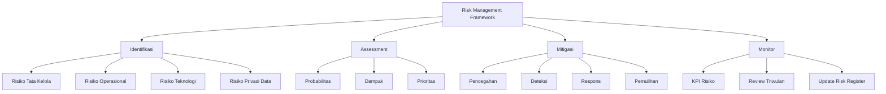
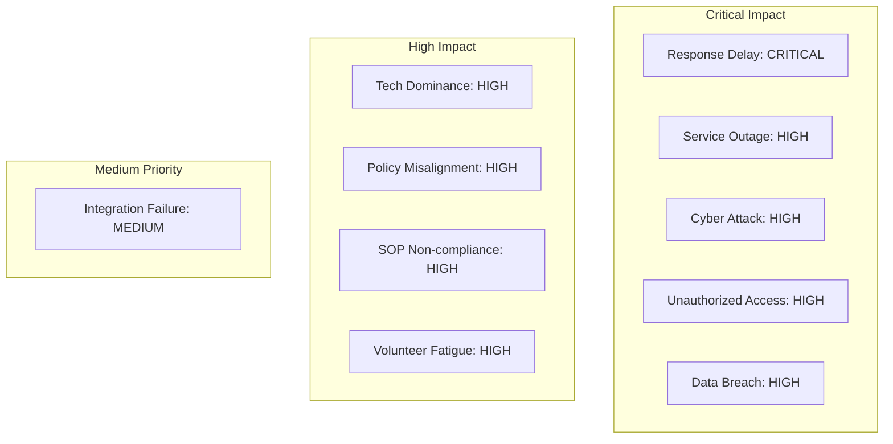
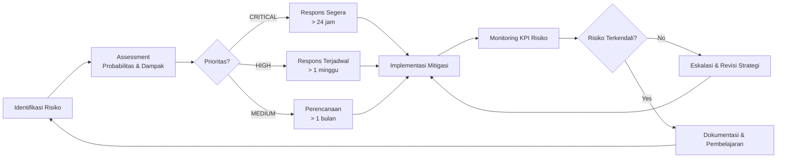

# Manajemen Risiko KREKI

Arsitektur risiko dan kepatuhan KREKI dirancang untuk memastikan seluruh aktivitas organisasi dan teknologi berjalan aman, patuh regulasi, dan terkendali.

## Pendekatan Manajemen Risiko

---

## 1. Risiko Tata Kelola (Governance Risk)

Risiko yang muncul akibat ketidakjelasan peran, tumpang tindih kewenangan, atau lemahnya pengawasan yang dapat mengaburkan fokus misi dan akuntabilitas.

### 1.1 Dominasi Teknologi atas Misi

**Deskripsi**: Keputusan teknis mendominasi mandat kemanusiaan, menggeser fokus dari penyelamatan nyawa.

**Probabilitas**: Medium | **Dampak**: High | **Prioritas**: HIGH

**Indikator**:
- Anggaran teknologi > 70% dari total anggaran
- Diskusi strategis lebih fokus pada fitur aplikasi daripada dampak sosial
- Steering Committee tidak terlibat dalam keputusan teknis utama

**Mitigasi**:
- Implementasi Model Akuntabilitas Ganda (Dual-Accountability)
- Steering Committee harus menyetujui keputusan teknis strategis
- KPI strategis harus memiliki bobot lebih tinggi dari KPI teknis

**Referensi**: ISO/IEC 38500 (2015); OECD (2015); The Open Group (2018)

### 1.2 Ketidaksinkronan Kebijakan

**Deskripsi**: Implementasi sistem tidak selaras dengan kebijakan organisasi atau regulasi nasional.

**Probabilitas**: Medium | **Dampak**: High | **Prioritas**: HIGH

**Indikator**:
- SOP operasional bertentangan dengan kebijakan formal
- Integrasi SATUSEHAT tidak mengikuti standar nasional
- Pelaporan tidak sesuai format Kemenkes

**Mitigasi**:
- Review kepatuhan triwulan oleh Operations Committee
- Integrasi early warning system untuk deteksi ketidaksesuaian
- Template SOP yang diverifikasi oleh legal

**Referensi**: Kemenkes RI (2023); The Open Group (2018)

---

## 2. Risiko Operasional (Operational Risk)

Risiko yang berkaitan dengan kegagalan proses, keterbatasan sumber daya manusia, dan ketidaksiapan lapangan yang berdampak langsung pada kualitas respons.

### 2.1 Keterlambatan Respons Relawan

**Deskripsi**: Relawan tidak mencapai lokasi dalam target waktu < 5 menit (urban) atau < 8 menit (rural).

**Probabilitas**: High | **Dampak**: Critical | **Prioritas**: CRITICAL

**Indikator**:
- P95 response time > target
- > 20% insiden dengan response time > 10 menit
- Hotspot geografis dengan coverage gap

**Mitigasi**:
- Optimalisasi algoritma geo-dispatch
- Target penambahan relawan di hotspot gap
- SOP eskalasi otomatis ke PSC 119 setelah 5 menit

**Referensi**: WHO (2018); PMI (2017); World Bank (2020)

### 2.2 Ketidaksesuaian SOP

**Deskripsi**: Relawan tidak mengikuti prosedur yang ditetapkan saat penanganan insiden.

**Probabilitas**: Medium | **Dampak**: High | **Prioritas**: HIGH

**Indikator**:
- Audit insiden menemukan penyimpangan > 10%
- Insiden dengan komplikasi meningkat
- Laporan pasca-insiden tidak lengkap

**Mitigasi**:
- Refresh pelatihan SOP setiap 6 bulan
- Checklist digital yang wajib diisi relawan
- Review insiden triwulan dengan feedback loop

**Referensi**: WHO (2019); World Bank (2020)

### 2.3 Kelelahan dan Ketidaksiapan Relawan

**Deskripsi**: Relawan mengalami burnout atau tidak tersedia saat dibutuhkan.

**Probabilitas**: Medium | **Dampak**: High | **Prioritas**: HIGH

**Indikator**:
- Tingkat retensi relawan < 80% per tahun
- Relawan aktif < 60% dari total tersertifikasi
- Survey kepuasan relawan menurun

**Mitigasi**:
- Program rotasi dan beban kerja seimbang
- Sistem penghargaan dan recognition
- Limit maksimal penugasan per relawan per bulan

**Referensi**: IFRC (2020); PMI (2017)

---

## 3. Risiko Teknologi (Technology Risk)

Risiko terkait gangguan sistem, kegagalan infrastruktur, dan kerentanan keamanan siber.

### 3.1 Gangguan Layanan Platform

**Deskripsi**: Sistem tidak dapat diakses saat kegawatdaruratan terjadi.

**Probabilitas**: Low | **Dampak**: Critical | **Prioritas**: HIGH

**Indikator**:
- Uptime < 99.9% target untuk Tier 1 services
- Downtime terjadi saat peak emergency
- Failover tidak berfungsi saat dibutuhkan

**Mitigasi**:
- Redundancy multi-region untuk critical services
- Offline contingency support untuk mobile apps
- Load testing bulanan untuk memvalidasi kapasitas

**Referensi**: ISO 22301 (2019); NIST (2020)

### 3.2 Kegagalan Integrasi Sistem Nasional

**Deskripsi**: Integrasi dengan PSC 119 atau SATUSEHAT tidak berfungsi.

**Probabilitas**: Low | **Dampak**: High | **Prioritas**: MEDIUM

**Indikator**:
- API call failure rate > 5%
- Data synchronization delay > 5 menit
- Error logs menunjukkan format mismatch

**Mitigasi**:
- Automated testing untuk integrasi setiap release
- API versioning dengan backward compatibility
- Standby manual process saat integrasi gagal

**Referensi**: Kemenkes RI (2023); WHO (2021)

### 3.3 Serangan Siber

**Deskripsi**: Sistem diserang oleh aktor jahat menyebabkan kebocoran data atau gangguan layanan.

**Probabilitas**: Low | **Dampak**: Critical | **Prioritas**: HIGH

**Indikator**:
- Attempted intrusions terdeteksi
- Data akses patterns mencurigakan
- Security alerts dari monitoring tools

**Mitigasi**:
- Zero Trust architecture implementation
- Regular security audits dan penetration testing
- Incident response team dengan SLA 1 jam

**Referensi**: ISO/IEC 27001 (2013); NIST (2020)

---

## 4. Risiko Privasi Data (Data Privacy Risk)

Risiko terkait pelanggaran kerahasiaan, penyalahgunaan, atau kebocoran data pribadi dan kesehatan.

### 4.1 Akses Data Tanpa Otorisasi

**Deskripsi**: Pihak tidak berwenang mengakses data sensitif pasien atau relawan.

**Probabilitas**: Low | **Dampak**: Critical | **Prioritas**: HIGH

**Indikator**:
- Access logs menunjukkan pola mencurigakan
- Data diakses di luar jam operasional
- User access tidak sesuai role-based permissions

**Mitigasi**:
- Multi-factor authentication untuk akses data sensitif
- Audit trail lengkap untuk setiap akses data
- Principle of least privilege enforcement

**Referensi**: ISO/IEC 27701 (2019); WHO (2021)

### 4.2 Kebocoran Data Kesehatan

**Deskripsi**: Data kesehatan bocor ke pihak eksternal melalui berbagai vector.

**Probabilitas**: Low | **Dampak**: Critical | **Prioritas**: HIGH

**Indikator**:
- Data ditemukan di dark web atau public forum
- Insiden phishing berhasil mengambil credentials
- Encryption vulnerabilities terdeteksi

**Mitigasi**:
- End-to-end encryption untuk data in transit dan at rest
- Regular security awareness training untuk staff
- Data Loss Prevention (DLP) system implementation

**Referensi**: Kemenkes RI (2023); ISO/IEC 27001 (2013)

---

## 5. Enterprise Risk Register

Inventaris terstruktur seluruh risiko enterprise dengan prioritas dan pemilik.

### 5.1 Risk Register Summary

| Risiko | Kategori | Probabilitas | Dampak | Prioritas | Pemilik |
|--------|----------|--------------|--------|-----------|---------|
| Dominasi teknologi atas misi | Governance | Medium | High | HIGH | Steering Committee |
| Ketidaksinkronan kebijakan | Governance | Medium | High | HIGH | Technical Board |
| Keterlambatan response relawan | Operational | High | Critical | CRITICAL | Program Management |
| Ketidaksesuaian SOP | Operational | Medium | High | HIGH | Program Management |
| Kelelahan relawan | Operational | Medium | High | HIGH | Program Management |
| Gangguan layanan platform | Technology | Low | Critical | HIGH | CTO |
| Kegagalan integrasi nasional | Technology | Low | High | MEDIUM | CTO |
| Serangan siber | Technology | Low | Critical | HIGH | CTO |
| Akses data tanpa otorisasi | Privacy | Low | Critical | HIGH | Data Owner |
| Kebocoran data kesehatan | Privacy | Low | Critical | HIGH | Data Custodian |

### 5.2 Risk Heat Map

---

## 6. Framework Manajemen Risiko

### 6.1 Siklus Manajemen Risiko

### 6.2 Pendekatan Mitigasi Berlapis

**Pencegahan (Prevention)**:
- Desain arsitektur yang resilient
- SOP yang jelas dan terdokumentasi
- Pelatihan dan sertifikasi berkelanjutan
- Security by design dan privacy by design

**Deteksi (Detection)**:
- Monitoring real-time untuk sistem dan operasional
- Audit insiden secara berkala
- Survey kepuasan relawan triwulan
- Security scanning otomatis

**Respons (Response)**:
- Alur eskalasi yang jelas (Level 1-3)
- Incident response team dengan SLA terdefinisi
- Communication protocol saat insiden
- Backup systems dan manual contingencies

**Pemulihan (Recovery)**:
- Disaster Recovery Plan dengan RTO/RPO jelas
- Business Continuity Plan untuk operasional
- Post-incident review dan lessons learned
- System improvements berdasarkan insiden

---

## 7. KPI Risiko

### 7.1 Leading Indicators

| KPI Risiko | Target | Frekuensi Ukur | Pemilik |
|------------|--------|----------------|---------|
| Risk register coverage | 100% risiko teridentifikasi | Triwulan | Risk Owner |
| Mitigation plan completion | 90% plan terimplementasi | Triwulan | Risk Owner |
| SOP compliance rate | > 95% | Bulanan | Program Management |
| Security audit findings | < 5 critical findings | Tahunan | CTO |

### 7.2 Lagging Indicators

| KPI Risiko | Target | Frekuensi Ukur | Pemilik |
|------------|--------|----------------|---------|
| Critical incidents | 0 insiden tidak terkendali | Real-time | Operations Committee |
| Data breach incidents | 0 insiden | Real-time | Data Custodian |
| Response time SLA breach | < 1% insiden | Bulanan | Program Management |
| System uptime | > 99.9% untuk Tier 1 | Bulanan | CTO |

---

## 8. Tata Kelola Risiko

### 8.1 Peran dan Tanggung Jawab

**Steering Committee**:
- Menyetujui framework manajemen risiko
- Review risk register triwulan
- Mengambil keputusan untuk risiko CRITICAL

**Technical Board**:
- Menilai risiko teknologi
- Menetapkan standar keamanan
- Review mitigation plan teknologi

**Operations Committee**:
- Memantau KPI risiko operasional
- Koordinasi respons insiden
- Review pelaporan kejadian

**Risk Owner (per kategori)**:
- Memiliki risk register untuk kategorinya
- Mengimplementasikan mitigasi risiko
- Melaporkan status risiko ke Steering Committee

### 8.2 Frekuensi Review

| Aktivitas | Frekuensi | Peserta | Output |
|-----------|-----------|----------|--------|
| Risk register update | Triwulan | Semua Risk Owner | Risk register terbaru |
| Risk assessment | Tahunan | Technical Board | Risk profile terbaru |
| Incident review | Per insiden | Operations Committee | Lessons learned |
| Framework review | Tahunan | Steering Committee | Framework improvement |

---

## 9. Kepatuhan Regulasi

### 9.1 Regulasi Nasional

| Regulasi | Area Fokus | Kepatuhan |
|----------|------------|-----------|
| UU PDP 2022 | Perlindungan data pribadi | Data privacy risk section |
| Permenkes SATUSEHAT | Interoperabilitas data | Technology & Integration risks |
| Peraturan PSC 119 | Koordinasi emergensi | Operational risk section |
| ISO 27001 | Keamanan informasi | Security architecture |

### 9.2 Standar Internasional

| Standar | Area Fokus | Aplikasi |
|---------|------------|----------|
| ISO 31000 | Manajemen risiko | Framework risiko enterprise |
| ISO 22301 | Business continuity | Disaster recovery & BCP |
| ISO/IEC 27001 | Keamanan IT | Security architecture |
| ISO/IEC 27701 | Privacy | Data privacy protection |
| NIST Cybersecurity Framework | Cybersecurity | Incident response |

---

## Related Documentation

- [IT Governance](../it-governance.md) - Governance structure dan RACI matrix
- [Security Architecture](./security-architecture.md) - Security domains dan controls
- [EA Governance](./ea-governance.md) - Tata kelola Enterprise Architecture
- [Emergency Playbook](../emergency-playbook.md) - Operational workflows
- [Incident Management](../incident-management.md) - Insiden response procedures

---

*Bagian dari [Enterprise Architecture KREKI](./index.md)*
