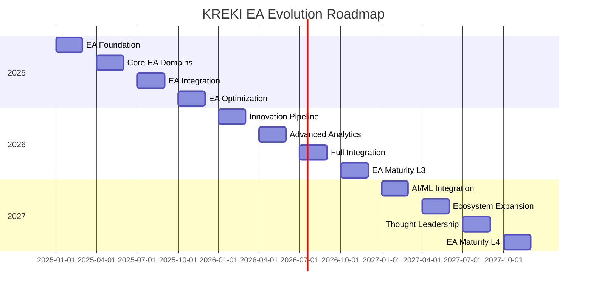

# EA Roadmap KREKI

EA Roadmap mendefinisikan evolusi Enterprise Architecture KREKI dari current state ke target state dalam 3 tahun ke depan.

## Strategic Timeline

---

## Year 1: 2025 - Foundation

### Q1 2025: EA Foundation

**Objectives:**
- Establish EA governance structure
- Create core EA documentation
- Define technology standards
- Establish EA review process

**Milestones:**

| Milestone | Owner | Status |
|-----------|-------|--------|
| Technical Board formed | CTO | ✅ Done |
| EA documentation created | Lead Architect | ✅ Done |
| Technology radar v1 published | Lead Architect | ✅ Done |
| EA review process defined | Operations Committee | ✅ Done |
| EA communication plan established | EA Custodian | ✅ Done |

**Key Deliverables:**
- ✅ EA index and all domain documents
- ✅ Technology radar (ADOPT/TRIAL/ASSESS/HOLD)
- ✅ EA governance framework
- ✅ EA metrics and KPIs

### Q2 2025: Core EA Domains

**Objectives:**
- Complete all EA domain documentation
- Align EA with existing documentation
- Establish compliance monitoring

**Milestones:**

| Milestone | Owner | Target |
|-----------|-------|--------|
| Business Architecture completed | Product + Tech | ✅ Done |
| Data Architecture completed | Data Architect | ✅ Done |
| Application Architecture completed | Lead Architect | ✅ Done |
| Technology Architecture completed | Lead Architect | ✅ Done |
| Security Architecture completed | Security Lead | ✅ Done |
| Integration Architecture completed | Integration Lead | ✅ Done |
| Innovation Framework completed | CTO | ✅ Done |
| EA Governance completed | Lead Architect | ✅ Done |
| EA Roadmap completed | Lead Architect | ✅ Done |

**Key Deliverables:**
- All 9 EA domain documents published
- Cross-references established with existing docs
- Compliance monitoring started

### Q3 2025: EA Integration

**Objectives:**
- Integrate EA with development workflow
- Establish EA compliance process
- Update main documentation index

**Milestones:**

| Milestone | Owner | Target |
|-----------|-------|--------|
| EA added to docs index | Lead Architect | 🚧 In Progress |
| EA review in ADR process | Tech Board | Q3 2025 |
| First quarterly EA review | Operations Committee | Q3 2025 |
| EA compliance monitoring started | DevOps Lead | Q3 2025 |
| Developer EA training completed | Lead Architect | Q3 2025 |

**Key Deliverables:**
- EA section in main docs/index.md
- EA compliance checklist for projects
- EA training materials for developers
- First quarterly EA review conducted

### Q4 2025: EA Optimization

**Objectives:**
- Conduct first annual EA refresh
- Optimize EA based on feedback
- Establish EA as living document

**Milestones:**

| Milestone | Owner | Target |
|-----------|-------|--------|
| Annual EA refresh completed | Technical Board | Q4 2025 |
| EA metrics dashboard deployed | DevOps Lead | Q4 2025 |
| EA feedback survey conducted | EA Custodian | Q4 2025 |
| Technology radar updated | Technical Board | Q4 2025 |
| Pilot projects evaluated | Innovation Board | Q4 2025 |

**Key Deliverables:**
- Updated EA documentation (v2.0)
- EA metrics dashboard live
- Technology radar v2 published
- 2-4 innovation pilots completed

---

## Year 2: 2026 - Integration & Innovation

### Q1 2026: Innovation Pipeline

**Objectives:**
- Establish formal innovation pipeline
- Launch pilot projects from Innovation Framework
- Evaluate emerging technologies

**Milestones:**

| Milestone | Owner | Target |
|-----------|-------|--------|
| Innovation pipeline established | CTO | Q1 2026 |
| 2 pilot projects launched | Innovation Board | Q1 2026 |
| Emerging tech assessment completed | Lead Architect | Q1 2026 |
| Partnerships explored | CTO | Q1 2026 |

**Focus Areas:**
- Offline-first mobile architecture
- ML-based dispatch optimization
- Event-driven architecture (RabbitMQ)
- GraphQL for API layer

### Q2 2026: Advanced Analytics

**Objectives:**
- Implement advanced analytics capabilities
- Enhance data warehouse
- Launch BI dashboards

**Milestones:**

| Milestone | Owner | Target |
|-----------|-------|--------|
| Data warehouse deployed | Data Architect | Q2 2026 |
| BI dashboards launched | Product + Tech | Q2 2026 |
| Advanced analytics APIs available | Data Team | Q2 2026 |
| Real-time metrics implemented | DevOps Lead | Q2 2026 |

**Focus Areas:**
- PostgreSQL columnar extensions
- Apache Airflow for data pipelines
- Grafana/Metabase for dashboards
- Real-time streaming analytics

### Q3 2026: Full Integration

**Objectives:**
- Complete SATUSEHAT full integration
- Integrate with PSC 119 systems
- Enhance hospital connectivity

**Milestones:**

| Milestone | Owner | Target |
|-----------|-------|--------|
| SATUSEHAT full integration | Integration Lead | Q3 2026 |
| PSC 119 real-time sync | Integration Lead | Q3 2026 |
| Hospital FHIR integration | Integration Lead | Q3 2026 |
| Integration hub deployed | DevOps Lead | Q3 2026 |

**Focus Areas:**
- FHIR R4 compliance
- Real-time data synchronization
- Event-driven integration patterns
- API gateway enhancements

### Q4 2026: EA Maturity Level 3

**Objectives:**
- Achieve EA Maturity Level 3 (Defined)
- Establish EA-driven investment decisions
- Implement continuous EA improvement

**Milestones:**

| Milestone | Owner | Target |
|-----------|-------|--------|
| EA maturity assessment completed | Technical Board | Q4 2026 |
| EA-driven investment process | CTO + Board | Q4 2026 |
| Continuous improvement process | Operations Committee | Q4 2026 |
| EA value quantified | Technical Board | Q4 2026 |

**Key Metrics:**
- EA compliance: 100%
- EA utilization: > 90%
- Innovation success rate: > 50%
- Stakeholder awareness: > 80%

---

## Year 3: 2027 - Advanced Capabilities

### Q1 2027: AI/ML Integration

**Objectives:**
- Integrate AI/ML capabilities
- Launch intelligent dispatch
- Implement predictive analytics

**Milestones:**

| Milestone | Owner | Target |
|-----------|-------|--------|
| ML model for dispatch deployed | Data Science Lead | Q1 2027 |
| Predictive analytics available | Data Science Lead | Q1 2027 |
| Triage assistance AI launched | Product + Tech | Q1 2027 |
| ML operations established | DevOps + Data Science | Q1 2027 |

**Focus Areas:**
- TensorFlow/PyTorch models
- MLOps pipeline (MLflow, Kubeflow)
- Real-time inference (< 500ms)
- Model monitoring and retraining

### Q2 2027: Ecosystem Expansion

**Objectives:**
- Expand partner ecosystem
- Integrate with emerging health tech
- Launch developer platform

**Milestones:**

| Milestone | Owner | Target |
|-----------|-------|--------|
| 10+ hospital integrations | Partnerships Lead | Q2 2027 |
| Developer portal launched | Product + Tech | Q2 2027 |
| API marketplace available | Product + Tech | Q2 2027 |
| University research partnerships | CTO | Q2 2027 |

**Focus Areas:**
- Partner integration platform
- API developer portal
- Sandbox environment
- Hackathons and challenges

### Q3 2027: Thought Leadership

**Objectives:**
- Publish research and case studies
- Present at conferences
- Establish KREKI as thought leader

**Milestones:**

| Milestone | Owner | Target |
|-----------|-------|--------|
| Research paper published | CTO + Academics | Q3 2027 |
| Conference presentations | CTO + Board | Q3 2027 |
| Case study series completed | Marketing + Tech | Q3 2027 |
| Open source contributions | Tech Team | Q3 2027 |

**Focus Areas:**
- Emergency response optimization
- Volunteer engagement analytics
- Healthcare data standards
- Digital health innovation

### Q4 2027: EA Maturity Level 4

**Objectives:**
- Achieve EA Maturity Level 4 (Managed)
- Establish EA as competitive advantage
- Implement predictive EA planning

**Milestones:**

| Milestone | Owner | Target |
|-----------|-------|--------|
| EA maturity L4 achieved | Technical Board | Q4 2027 |
| EA value quantified ($ saved) | CTO + Board | Q4 2027 |
| Predictive EA planning active | Technical Board | Q4 2027 |
| Industry benchmarking completed | CTO | Q4 2027 |

**Key Metrics:**
- EA-driven innovation: 3+ per quarter
- EA contribution to mission: Quantified
- Industry recognition: Awards, recognition
- Talent attraction: Top tech talent joins

---

## Target State Vision

### 2028: World-Class Digital Humanitarian Organization

**Characteristics:**

| Aspect | Description |
|--------|-------------|
| **Technology** | AI/ML-powered, real-time, predictive |
| **Integration** | Fully integrated with national health ecosystem |
| **Innovation** | Continuous innovation pipeline, 2+ innovations per quarter |
| **Impact** | Measurable impact on lives saved, response time |
| **Recognition** | Thought leader in digital health, humanitarian tech |

**Capabilities:**
- Predictive emergency dispatch (AI-optimized)
- Real-time video consultation (5G)
- Augmented reality guidance for volunteers
- Autonomous AED delivery (drones)
- Nationwide coverage (100% kabupaten)

**Integration:**
- Full SATUSEHAT integration
- Real-time PSC 119 sync
- 500+ hospital integrations
- 10,000+ active volunteers
- 1M+ app downloads

---

## Dependencies & Risks

### Dependencies

| Dependency | Impact | Mitigation |
|------------|--------|------------|
| **Funding** | High | Diversified funding sources, grants |
| **Talent** | High | Training, partnerships, competitive compensation |
| **Technology Partners** | Medium | Multi-cloud strategy, vendor diversity |
| **Regulatory Approval** | Medium | Early engagement, compliance-by-design |
| **Internet Infrastructure** | Medium | Offline-first architecture |

### Risks

| Risk | Probability | Impact | Mitigation |
|------|-------------|--------|------------|
| **Technology changes** | High | High | Technology radar, flexible architecture |
| **Security breach** | Low | Critical | Zero Trust architecture, security audits |
| **Vendor lock-in** | Medium | High | Multi-cloud, open source preference |
| **Regulatory changes** | Medium | High | Compliance monitoring, adaptability |
| **Scalability issues** | Low | High | Load testing, microservices architecture |

---

## Success Metrics

### Year-Over-Year Targets

| Metric | 2025 | 2026 | 2027 | 2028 |
|--------|------|------|------|------|
| **EA Maturity Level** | 2 | 3 | 4 | 5 |
| **Technology Adoption** | 2/quarter | 3/quarter | 4/quarter | 5/quarter |
| **Pilot Projects** | 4 | 6 | 8 | 10 |
| **Innovation Success Rate** | 30% | 50% | 60% | 70% |
| **EA Compliance** | 80% | 95% | 100% | 100% |
| **Developer EA Awareness** | 50% | 80% | 90% | 95% |

### Mission Impact Targets

| Metric | 2025 | 2026 | 2027 | 2028 |
|--------|------|------|------|------|
| **Response Time (P95)** | 8 min | 6 min | 5 min | 4 min |
| **Volunteer Density** | 5/10k | 7/10k | 10/10k | 15/10k |
| **Survival Rate (Cardiac)** | 20% | 30% | 40% | 50% |
| **Geographic Coverage** | 50% | 70% | 90% | 100% |

---

## Related Documentation

- [EA Governance](./ea-governance.md) - EA management processes
- [Innovation Framework](./innovation-framework.md) - Technology radar and pilots
- [IT Governance](../it-governance.md) - Implementation governance

---

*Kembali ke [Enterprise Architecture](./index.md)*
