# Security Architecture KREKI

Security Architecture mendefinisikan domain keamanan menyeluruh, kontrol keamanan, dan kepatuhan regulasi untuk melindungi data dan sistem KREKI.

## Security Domains Overview

```mermaid
graph TD
    SA[KREKI Security Architecture]

    SA --> IAM[Identity & Access Management]
    SA --> DS[Data Security]
    SA --> AS[Application Security]
    SA --> IS[Infrastructure Security]
    SA --> CG[Compliance & Governance]

    IAM --> IAM1[KREKI ID SSO]
    IAM --> IAM2[MFA/2FA]
    IAM --> IAM3[Role-Based Access Control]
    IAM --> IAM4[Privileged Access]

    DS --> DS1[Encryption]
    DS --> DS2[Data Masking]
    DS --> DS3[DLP]
    DS --> DS4[Privacy by Design]

    AS --> AS1[OWASP Top 10]
    AS --> AS2[API Security]
    AS --> AS3[Secure Coding]
    AS --> AS4[Vulnerability Management]

    IS --> IS1[Network Segmentation]
    IS --> IS2[Firewall Rules]
    IS --> IS3[Container Security]
    IS --> IS4[Secret Management]

    CG --> CG1[PDP Law 2022]
    CG --> CG2[Healthcare Standards]
    CG --> CG3[Security Training]
    CG --> CG4[Third-Party Risk]
```



---

## 1. Identity & Access Management (IAM)

### 1.1 KREKI ID (Single Sign-On)

**Purpose:** Centralized identity management untuk seluruh ekosistem digital KREKI.

**Features:**
- Unified authentication for all applications
- Single sign-on (SSO) across services
- Federated identity (Google, Facebook login)
- Session management (24-hour access token, 30-day refresh)

**Architecture:**
```
Client Application → KREKI ID (Auth Service) → JWT Token → Access Other Services
```

### 1.2 Multi-Factor Authentication (MFA)

**Current State:**
- Optional MFA for admin accounts

**Target State:**
- Mandatory MFA for:
  - Admin users
  - Volunteers with access to emergency data
  - Partner organizations (PSC 119, Hospitals)

**MFA Methods:**
| Method | Status | Use Case |
|--------|--------|----------|
| **TOTP (Google Authenticator)** | ADOPT | Primary MFA method |
| **SMS OTP** | ADOPT | Backup method |
| **Biometric (Fingerprint/Face)** | TRIAL | Mobile app MFA |

### 1.3 Role-Based Access Control (RBAC)

**Roles:**
| Role | Description | Permissions |
|------|-------------|-------------|
| **Public** | Masyarakat umum | Panic button, view public info |
| **Volunteer** | Relawan terdaftar | Volunteer mode, profile management |
| **Volunteer Lead** | Koordinator relawan | Manage volunteers in area |
| **Training Admin** | Admin pelatihan | Manage courses, certificates |
| **Ops Admin** | Admin operasional | View all emergency data |
| **System Admin** | Admin sistem | Full system access |
| **Partner** | Mitra eksternal | Limited API access |

**Access Control Matrix:**

| Resource | Public | Volunteer | Lead | Training Admin | Ops Admin | System Admin | Partner |
|----------|--------|-----------|------|---------------|-----------|--------------|---------|
| Panic Button | ✅ | ✅ | ✅ | ✅ | ✅ | ✅ | ❌ |
| Emergency Data (Own) | ❌ | ✅ | ✅ | ❌ | ✅ | ✅ | ❌ |
| Emergency Data (All) | ❌ | ❌ | ✅ (area) | ❌ | ✅ | ✅ | ✅ (limited) |
| Volunteer Profile | ❌ | ✅ (own) | ✅ (area) | ✅ | ✅ | ✅ | ❌ |
| Training Materials | ✅ (view) | ✅ | ✅ | ✅ | ✅ | ✅ | ❌ |
| Certificates | ❌ | ✅ (own) | ✅ (area) | ✅ | ✅ | ✅ | ❌ |
| System Config | ❌ | ❌ | ❌ | ❌ | ❌ | ✅ | ❌ |

### 1.4 Privileged Access Management (PAM)

**Privileged Accounts:**
- Database access (PostgreSQL)
- Server access (SSH)
- Cloud provider access (AWS console)
- Secret management access

**Controls:**
- No shared privileged accounts
- Privileged access logging (who accessed what, when)
- Just-in-time access (temporary elevation)
- Regular access review (quarterly)

---

## 2. Data Security

### 2.1 Encryption

**Encryption Standards:**

| Data Type | At Rest | In Transit | Algorithm |
|-----------|---------|------------|-----------|
| **Health Data** | ✅ Required | ✅ Required | AES-256, TLS 1.3 |
| **Personal Data (PII)** | ✅ Required | ✅ Required | AES-256, TLS 1.3 |
| **Location Data** | ✅ Required | ✅ Required | AES-256, TLS 1.3 |
| **Public Data** | Optional | ✅ Required | - |

**Implementation:**
- **At Rest:** PostgreSQL transparent data encryption (TDE) or filesystem encryption
- **In Transit:** TLS 1.3 for all API calls, HTTPS only
- **Mobile:** Encrypted SQLite (SQLCipher) for local cache

### 2.2 Data Masking

**Use Cases:**
- Display in logs (mask sensitive data)
- Analytics (anonymize personal identifiers)
- Testing (fake data instead of real)

**Masking Rules:**
```yaml
Email: "j***@example.com"
Phone: "+628*****123"
Location: "[PROTECTED]" for coordinates
Name: "John D***" for partial masking
```

### 2.3 Data Loss Prevention (DLP)

**Policies:**
| Policy | Description | Action |
|--------|-------------|--------|
| **No Export** | Prevent bulk export of sensitive data | Block API |
| **Access Logging** | Log all access to health data | Alert + Log |
| **Anomaly Detection** | Detect unusual data access patterns | Alert |
| **Retention Enforcement** | Auto-delete data after retention period | Purge |

### 2.4 Privacy by Design

**Principles:**
1. **Minimization:** Collect only necessary data
2. **Consent:** Explicit consent for sensitive data
3. **Transparency:** Clear privacy policy
4. **User Control:** Users can access, correct, delete data
5. **Security:** Implement appropriate security measures

**Implementation:**
- Privacy impact assessment for new features
- Default privacy-friendly settings
- Privacy-focused user interface

---

## 3. Application Security

### 3.1 OWASP Top 10 Controls

| Risk | Control | Implementation |
|------|---------|----------------|
| **A01: Broken Access Control** | RBAC enforcement | Auth service checks on every request |
| **A02: Cryptographic Failures** | Encryption | TLS 1.3, AES-256 |
| **A03: Injection** | Input validation | Parameterized queries, input sanitization |
| **A04: Insecure Design** | Threat modeling | Security review in design phase |
| **A05: Security Misconfiguration** | Hardening | Remove default credentials, disable debug |
| **A06: Vulnerable Components** | Dependency scanning | npm audit, Snyk |
| **A07: Auth Failures** | MFA, rate limiting | MFA for admin, 5 req/sec limit |
| **A08: Data Integrity Failures** | Digital signatures | Certificate signing |
| **A09: Logging Failures** | Audit logs | Centralized logging |
| **A10: SSRF** | Input validation | Validate URLs, block internal IPs |

### 3.2 API Security

**Controls:**

| Control | Description | Implementation |
|---------|-------------|----------------|
| **Authentication** | Verify caller identity | JWT tokens, API keys |
| **Authorization** | Check permissions | Role-based access checks |
| **Rate Limiting** | Prevent abuse | 5 req/sec per IP (leaky bucket) |
| **Input Validation** | Prevent injection | Schema validation, sanitization |
| **Output Encoding** | Prevent XSS | JSON encoding, HTML escaping |
| **CORS Policy** | Control cross-origin | Whitelist allowed origins |
| **API Versioning** | Maintain compatibility | `/api/v1/`, `/api/v2/` |

**Security Headers:**
```
Strict-Transport-Security: max-age=31536000; includeSubDomains
X-Content-Type-Options: nosniff
X-Frame-Options: DENY
X-XSS-Protection: 1; mode=block
Content-Security-Policy: default-src 'self'
```

### 3.3 Secure Coding Practices

**Mandatory Practices:**
1. Code review for all changes
2. Security testing before deployment
3. Dependency vulnerability scanning
4. Secrets never in code (use environment variables/secret manager)
5. Error messages don't leak sensitive info

**Prohibited:**
- Hardcoded passwords/keys
- Direct SQL queries with concatenation
- eval() or similar dynamic code execution
- Debug information in production

### 3.4 Vulnerability Management

**Process:**

1. **Discovery:**
   - Automated scanning (Snyk, OWASP ZAP)
   - Manual penetration testing (yearly)
   - Bug bounty program (future)

2. **Prioritization:**
   - Critical: Fix within 24 hours
   - High: Fix within 7 days
   - Medium: Fix within 30 days
   - Low: Fix within 90 days

3. **Remediation:**
   - Patch application
   - Update dependencies
   - Configure compensating controls

4. **Verification:**
   - Retest to confirm fix
   - Document lessons learned

---

## 4. Infrastructure Security

### 4.1 Network Segmentation

**Zones:**

```
Internet (Untrusted)
    ↓
DMZ (Public Services)
    ├── API Gateway (Kong)
    ├── Load Balancer (NGINX)
    └── CDN (Cloudflare)
    ↓
Application Zone (Services)
    ├── Auth Service
    ├── Emergency Service
    ├── LMS Service
    └── Other Services
    ↓
Data Zone (Databases)
    ├── PostgreSQL
    └── Redis
```

**Firewall Rules:**

| Source | Destination | Port | Protocol | Purpose |
|--------|-------------|------|----------|---------|
| Internet | DMZ | 443 | HTTPS | Public API |
| DMZ | App Zone | 8080-9000 | HTTP | Service communication |
| App Zone | Data Zone | 5432 | PostgreSQL | Database access |
| App Zone | Data Zone | 6379 | Redis | Cache access |
| Admin VPN | App Zone | 22 | SSH | Server management |

### 4.2 Container Security

**Controls:**

| Control | Description | Implementation |
|---------|-------------|----------------|
| **Image Scanning** | Scan for vulnerabilities | Trivy, Snyk |
| **Minimal Images** | Reduce attack surface | Alpine-based images |
| **Non-root User** | Run as non-root | Dockerfile USER directive |
| **Read-only FS** | Prevent runtime modifications | Read-only root filesystem |
| **Resource Limits** | Prevent DoS | CPU, memory limits |
| **Network Policies** | Control pod communication | Kubernetes NetworkPolicies (if using K8s) |

### 4.3 Secret Management

**Secrets to Protect:**
- Database passwords
- API keys (Google Maps, FCM, SATUSEHAT)
- JWT signing keys
- Encryption keys
- Third-party credentials

**Tools:**

| Tool | Status | Rationale |
|------|--------|-----------|
| **HashiCorp Vault** | ASSESS | Full-featured, complex setup |
| **AWS Secrets Manager** | ADOPT (if on AWS) | Managed, integrates with AWS |
| **Environment Variables** | ADOPT | Simple, for smaller deployments |
| **Encrypted Files** | HOLD | Not ideal for production |

**Best Practices:**
- Rotate secrets quarterly
- Different secrets per environment (dev, staging, prod)
- Never commit secrets to git
- Audit secret access logs

---

## 5. Compliance & Governance

### 5.1 PDP Law 2022 Compliance

**UU Perlindungan Data Pribadi No. 27/2022**

**Key Requirements:**

| Requirement | Implementation | Status |
|-------------|----------------|--------|
| **Consent** | Explicit consent for health data | 🚧 In Progress |
| **Data Collection** | Collect only necessary data | ✅ Implemented |
| **Data Access** | Log all access to personal data | 🚧 In Progress |
| **Data Correction** | Allow users to correct data | ✅ Implemented |
| **Data Deletion** | Allow users to request deletion | 🚧 In Progress |
| **Data Portability** | Allow users to export data | 🚧 In Progress |
| **Breach Notification** | Notify users within 3x24 hours | 🚧 In Progress |

**Data Categories:**

| Category | Description | Protection Level |
|----------|-------------|------------------|
| **Sensitive Data** | Health data, biometric | High |
| **Personal Data** | Name, email, phone | Medium |
| **Public Data** | Publicly available info | Low |

### 5.2 Healthcare Security Standards

**Regulations:**

| Regulation | Requirements | Status |
|------------|--------------|--------|
| **Kemenkes Data Standards** | FHIR compliance, data exchange | ✅ Aligned |
| **SATUSEHAT Integration** | FHIR R4, OAuth 2.0 | ✅ Implemented |
| **Hospital Data Exchange** | HL7 FHIR | ✅ Aligned |

### 5.3 Security Awareness Training

**Target Audience:**

| Audience | Topics | Frequency |
|----------|--------|-----------|
| **Developers** | Secure coding, OWASP Top 10 | Quarterly |
| **Admins** | Phishing awareness, password hygiene | Biannually |
| **Volunteers** | Data privacy, app security | Onboarding + Annual |
| **Partners** | Integration security, API security | Onboarding |

### 5.4 Third-Party Risk Management

**Partner Risk Assessment:**

| Partner Type | Risk Level | Controls |
|--------------|------------|----------|
| **Hospital** | High | Data processing agreement, API security |
| **PSC 119** | High | Integration security, SLA |
| **University** | Medium | Research data anonymization |
| **Corporate (CSR)** | Low | Brand usage guidelines |

**Due Diligence:**
- Security assessment before onboarding
- Annual security review
- Right to audit (for high-risk partners)

---

## Security Operations

### Incident Response

**Security Incident Classification:**

| Severity | Description | Response Time |
|----------|-------------|---------------|
| **SEV-1** | Data breach, system compromise | < 1 hour |
| **SEV-2** | Security control bypass | < 4 hours |
| **SEV-3** | Policy violation | < 24 hours |
| **SEV-4** | Minor security issue | Next business day |

**Incident Response Process:**
1. Detection & Analysis
2. Containment
3. Eradication
4. Recovery
5. Post-Incident Review

### Security Monitoring

**Tools:**

| Tool | Purpose |
|------|---------|
| **Sentry** | Error tracking, security exceptions |
| **Datadog/New Relic** | Performance and security monitoring |
| **AWS CloudTrail** | Audit logging |
| **Fail2ban** | Intrusion prevention |

**Alerts:**
- Failed login attempts (> 5 per IP)
- Unusual data access patterns
- API rate limit breaches
- Vulnerability scan results

---

## Related Documentation

- [IT Governance](../it-governance.md) - Security policies and procedures
- [Incident Management](../incident-management.md) - Incident response
- [Data Architecture](./data-architecture.md) - Data privacy and classification

---

*Kembali ke [Enterprise Architecture](./index.md)*
