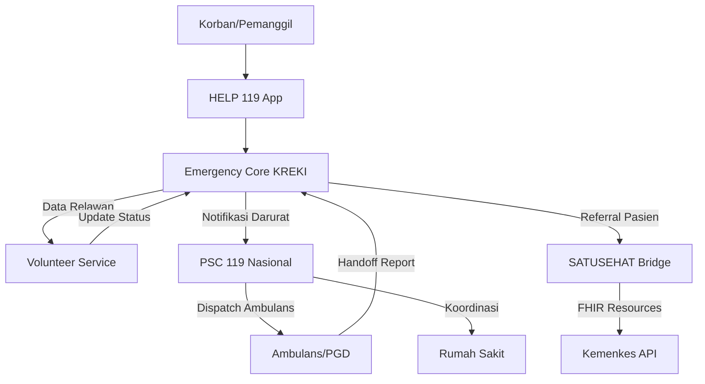

# Integrasi Stakeholder Eksternal

Dokumen ini menjelaskan protokol dan standar integrasi KREKI dengan stakeholder eksternal dalam ekosistem respons darurat kesehatan di Indonesia.

## Overview

**Tujuan:** Memastikan integrasi yang mulus antara sistem HELP 119 dengan ekosistem layanan darurat yang sudah ada (PSC 119, rumah sakit, ambulans) untuk memberikan respons yang cepat dan terkoordinasi.

**Scope:** Integrasi teknis (API/FHIR), protokol operasional, dan standar komunikasi data antar sistem.

---

## Arsitektur Integrasi

### Diagram Integrasi



---

## Integrasi dengan PSC 119

### Peran PSC 119

PSC 119 (Public Safety Center) adalah pusat komando nasional untuk layanan darurat yang mengintegrasikan:
- **Ambulans 119**: Ambulans darurat milik pemerintah
- **Polisi 110**: Untuk keamanan lokasi kejadian
- **Pemadam 113**: Untuk ekstraksi korban terjebak
- **SAR Nasional**: Untuk pencarian dan penyelamatan
- **BPBD**: Untuk penanganan bencana

### Protokol Integrasi Teknis

#### 1. API Integration

**Endpoint PSC 119 untuk Integrasi:**

```
POST https://api.psc119.go.id/v1/emergency-alert
```

**Request Format:**
```json
{
  "emergency_id": "uuid-v4",
  "organization": "KREKI",
  "location": {
    "latitude": -6.2088,
    "longitude": 106.8456,
    "address": "Jl. Sudirman No. 1, Jakarta Pusat"
  },
  "type": "medical_emergency",
  "severity": "SEV-1",
  "description": "Cardiac arrest, CPR in progress",
  "victim_count": 1,
  "volunteer_on_scene": true,
  "requested_resources": ["ambulance", "paramedic"],
  "timestamp": "2025-01-07T10:30:00Z",
  "callback_url": "https://api.kreki.or.id/callback/psc119/{emergency_id}"
}
```

**Response Format:**
```json
{
  "status": "received",
  "psc_ticket_id": "PSC-2025-01-07-001234",
  "estimated_arrival": "15 minutes",
  "dispatched_resources": [
    {
      "type": "ambulance",
      "id": "AMB-119-001",
      "location": "RSUP Fatmawati"
    }
  ]
}
```

#### 2. Authentication & Security

- **Authentication Method**: Mutual TLS (mTLS)
- **API Key**: Diperoleh dari registrasi resmi ke Kemenkes
- **IP Whitelist**: Hanya IP KREKI yang terdaftar yang dapat mengakses
- **Encryption**: TLS 1.3 untuk semua komunikasi

#### 3. Data Mapping

| Field HELP 119 | Field PSC 119 | Notes |
|----------------|---------------|-------|
| `emergency_id` | `external_reference_id` | UUID KREKI untuk tracking |
| `severity` | `priority_code` | SEV-1 → P1, SEV-2 → P2, SEV-3 → P3 |
| `type` | `incident_category` | Mapping ke standar PSC 119 |
| `location.latitude/longitude` | `geolocation` | WGS 84 format |
| `requested_resources` | `resource_request` | array dari resource types |

### Protokol Operasional

#### Kapan Menghubungi PSC 119

**Segera Hubungi (Automatic Escalation):**
- SEV-1 incidents yang tidak membaik setelah 5 menit intervensi relawan
- Multiple casualties (3+ korban)
- Kecelakaan dengan korban terjebak (memerlukan ekstraksi)
- Bencana alam (gempa, banjir, tanah longsor)

**Konsultasi Dahulu:**
- SEV-2 incidents yang memerlukan penilaian medis profesional
- Situasi yang tidak jelas severity-nya

**Tidak Perlu:**
- SEV-3 incidents yang dapat diselesaikan relawan

#### Communication Flow

```
1. Emergency Core mengirim alert ke PSC 119
   ↓
2. PSC 119 mengkonfirmasi penerimaan (ticket ID)
   ↓
3. Volunteer Coordinator memantau status dispatch
   ↓
4. Relawan di lapangan memberikan update situasi
   ↓
5. PSC 119 menginformasikan ETA ambulans
   ↓
6. Handoff: Relawan → Tim PSC 119
   ↓
7. Emergency Core mengirim summary kejadian ke PSC 119
```

#### Standar Komunikasi

**Format Situational Report (SITREP) ke PSC 119:**

```
PSC 119, ini KREKI.
Emergency ID: {uuid}
Lokasi: {latitude}, {longitude}
Jenis Kejadian: {type}
Severity: {SEV-1/2/3}
Jumlah Korban: {n}
Kondisi Terkini: {status}
Intervensi yang Dilakukan: {interventions}
Permintaan Bantuan: {resources}
```

---

## Integrasi dengan Rumah Sakit

### Standar Interoperabilitas FHIR

KREKI menggunakan **FHIR R4** (Fast Healthcare Interoperability Resources) untuk integrasi dengan sistem rumah sakit melalui SATUSEHAT Bridge.

#### FHIR Resources yang Digunakan

**1. Patient Resource**
```json
{
  "resourceType": "Patient",
  "id": "patient-kreki-001",
  "identifier": [
    {
      "system": "https://satusehat.kemkes.go.id/id/pasien",
      "value": "NRM-123456"
    }
  ],
  "name": [{
    "text": "Budi Santoso"
  }],
  "gender": "male",
  "birthDate": "1985-05-15",
  "telecom": [{
    "system": "phone",
    "value": "081234567890"
  }]
}
```

**2. Encounter Resource** (Kontak dengan Layanan Kesehatan)
```json
{
  "resourceType": "Encounter",
  "id": "encounter-kreki-001",
  "status": "in-progress",
  "class": {
    "system": "http://terminology.hl7.org/CodeSystem/v3-ActCode",
    "code": "EMER",
    "display": "emergency"
  },
  "subject": {
    "reference": "Patient/patient-kreki-001"
  },
  "period": {
    "start": "2025-01-07T10:30:00+07:00"
  },
  "location": [{
    "location": {
      "reference": "Location/loc-ambulance-119"
    },
    "status": "active"
  }]
}
```

**3. Observation Resource** (Data vital signs)
```json
{
  "resourceType": "Observation",
  "id": "obs-vital-001",
  "status": "final",
  "code": {
    "coding": [{
      "system": "http://loinc.org",
      "code": "8867-4",
      "display": "Heart rate"
    }]
  },
  "subject": {
    "reference": "Patient/patient-kreki-001"
  },
  "valueQuantity": {
    "value": 120,
    "unit": "beats/minute",
    "system": "http://unitsofmeasure.org",
    "code": "/min"
  }
}
```

**4. Practitioner Resource** (Data Relawan)
```json
{
  "resourceType": "Practitioner",
  "id": "practitioner-kreki-001",
  "identifier": [{
    "system": "https://kreki.or.id/id/relawan",
    "value": "KREKI-2023-001"
  }],
  "name": [{
    "text": "dr. Ahmad, Sp.PD"
  }],
  "qualification": [{
    "code": {
      "coding": [{
        "system": "http://terminology.hl7.org/CodeSystem/v2-0360",
        "code": "MD",
        "display": "Doctor of Medicine"
      }]
    }
  }]
}
```

### API Integration SATUSEHAT

#### Endpoint SATUSEHAT

**Base URL:** `https://api-satusehat.kemkes.go.id/fhir-r4/v1/`

**Authentication:** OAuth 2.0 Client Credentials Flow

#### Contoh: Kirim Data Pasien ke SATUSEHAT

```bash
POST https://api-satusehat.kemkes.go.id/fhir-r4/v1/Patient
Authorization: Bearer {access_token}
Content-Type: application/fhir+json

{
  "resourceType": "Patient",
  "identifier": [...],
  "name": [...],
  ...
}
```

#### Contoh: Query Data Riwayat Medis Pasien

```bash
GET https://api-satusehat.kemkes.go.id/fhir-r4/v1/Patient?identifier=https://satusehat.kemkes.go.id/id/pasien|NRM-123456
Authorization: Bearer {access_token}
```

### Workflow Referral ke Rumah Sakit

#### 1. Pre-Arrival Notification

**Ketika relawan memutuskan untuk merujuk ke rumah sakit:**

```
Emergency Core → SATUSEHAT Bridge → Rumah Sakit Tujuan

Data yang dikirim:
- Data demografi pasien (FHIR Patient)
- Vital signs terakhir (FHIR Observation)
- Riwayat intervensi yang dilakukan (FHIR Procedure)
- Estimasi waktu kedatangan
```

#### 2. Handoff di Rumah Sakit

**Prosedur:**
1. Relawan mengantar pasien ke UGD rumah sakit
2. Relawan memberikan laporan singkat kepada perawat UGD
3. Relawan menyerahkan QR Code/Link berisi data FHIR lengkap
4. Rumah sakit mengakses data melalui SATUSEHAT
5. Emergency Core menandai kasus sebagai "resolved - handed to hospital"

#### 3. Post-Handoff Documentation

**Yang perlu dilengkapi:**
- Waktu kedatangan di rumah sakit
- Nama rumah sakit tujuan
- Status pasien saat handoff (stable/critical/improved)
- Nomor rekam medis rumah sakit (jika ada)

---

## Standar Data & Interoperabilitas

### Terminologi Medis

**Sistem Klasifikasi yang Digunakan:**

| Terminologi | Penggunaan | Contoh |
|-------------|------------|--------|
| **ICD-10** | Diagnosis penyakit | I21 - Acute myocardial infarction |
| **SNOMED CT** | Kode klinis komprehensif | 22298006 - Myocardial infarction |
| **LOINC** | Laboratory observations | 8867-4 - Heart rate |
| **RxNorm** | Obat-obatan | 316074 - Aspirin |

### Metadata Standar

**Semua data yang dikirim ke eksternal harus memiliki:**

```json
{
  "meta": {
    "source": "KREKI-HELP119",
    "version": "1.0.0",
    "timestamp": "2025-01-07T10:30:00Z",
    "security": [{
      "system": "http://terminology.hl7.org/CodeSystem/v3-Confidentiality",
      "code": "N",
      "display": "normal"
    }]
  }
}
```

---

## Security & Compliance

### Privasi Data

**Prinsip:**
- Data pasien hanya dikirim ke sistem yang berwenang (PSC 119, SATUSEHAT)
- No sensitive data disimpan di device relawan setelah handoff
- Semua komunikasi terenkripsi
- Audit trail untuk semua akses data

**Kepatuhan:**
- **UU 11/2008**: Informasi dan Transaksi Elektronik
- **UU 29/2004**: Praktik Kedokteran
- **Permenkes 20/2019**: Pelaksanaan Pelayanan Terpadu Gawat Darurat
- **FHIR Standards**: Standar internasional interoperabilitas kesehatan

### Audit Trail

**Semua integrasi dengan eksternal harus mencatat:**
- Timestamp setiap request/response
- Payload data (sanitized for sensitive info)
- Status code
- Error log (jika ada)
- Initiator (system/user)

**Contoh Format Log:**
```json
{
  "timestamp": "2025-01-07T10:30:00Z",
  "direction": "outbound",
  "system": "PSC-119",
  "operation": "POST /v1/emergency-alert",
  "request_id": "req-uuid-001",
  "emergency_id": "emerg-uuid-001",
  "status_code": 200,
  "processing_time_ms": 250
}
```

---

## Monitoring & KPIs

### KPIs Integrasi Eksternal

| Metric | Target | Measurement |
|--------|--------|-------------|
| **API Availability** | > 99.5% | Uptime monitoring |
| **Response Time PSC 119** | < 1s (P95) | API logs |
| **Data Transmission Success** | > 99% | Success/failure rate |
| **Handoff Accuracy** | > 95% | Hospital feedback |
| **FHIR Validation Pass** | 100% | Pre-send validation |

### Alerting

**Critical Alerts:**
- PSC 119 API down (> 5 min)
- SATUSEHAT Bridge errors (> 10/min)
- Failed data transmission (> 5% in 1 hour)
- Authentication failures

**Notification Channel:**
- PagerDuty untuk Engineering Team
- WhatsApp group untuk Operations Team

---

## Disaster Recovery

### Backup Communication

**Jika sistem online down:**
- Phone line ke PSC 119: 119
- Radio komunikasi (jika tersedia)
- Manual SITREP form untuk dokumentasi

### Data Recovery

**Jika SATUSEHAT down:**
- Queue data locally
- Retry dengan exponential backoff
- Fallback ke manual paperwork di rumah sakit

---

## Related Documentation

- [Emergency Response Playbook](./emergency-playbook.md) - Workflow respon darurat lengkap
- [Microservices Design](../architecture/microservices-design.md) - SATUSEHAT Bridge service specifications
- [Incident Management](./incident-management.md) - Prosedur insiden teknis

---

*Kembali ke [Governance](./index.md)*
