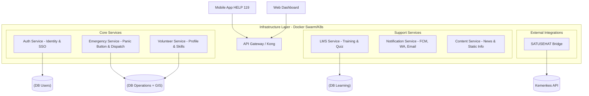

# System Architecture

This document describes the technical design of the KREKI information system based on **Microservices** architecture. Each service is designed to run in containers (Docker) and communicate via RESTful API or gRPC.

## High-Level Diagram

## Design Principles

### 1. Database per Service
Each microservice has its own database. Cross-database queries are **strictly prohibited**. Data communication must be via API.

### 2. Stateless
Applications must not store user state in server memory. Use Redis or Database for session management.

### 3. API First
Before coding begins, API definitions (Swagger/OpenAPI Spec) must be approved by the Lead Architect.

### 4. Containerized
All applications must be containerized with Docker for easy deployment on any infrastructure.

## Microservices Detail

### A. Auth Service (KREKI ID)

**Function:**
- Registration, Login, JWT Token generation
- Role Management (Public vs Volunteer vs Admin)

**Recommended Stack:** Node.js / Go

**Database:** PostgreSQL (Tables: users, roles, permissions)

---

### B. Emergency Core Service (CRITICAL)

**Function:**
- Receive Panic Button signals
- Algorithm for finding nearest volunteer (Radius 500m - 2km)
- Response time tracking

**Recommended Stack:** Node.js (for fast I/O handling) or Go

**Database:** PostgreSQL with **PostGIS** extension (mandatory for accurate geospatial queries)

**Availability:** Must be hosted on the most stable infrastructure (High Availability)

---

### C. LMS Service

**Function:**
- Manage training modules, videos, quizzes
- Pre-test/post-test management
- E-certificate generation

**Recommended Stack:** PHP (Laravel) or Python (Django) - easier for junior developers/interns

**Special Feature:** Payment Gateway integration (optional for paid classes)

---

### D. Integration Bridge (SATUSEHAT)

**Function:**
- Wrapper for external APIs to prevent changes from Kemenkes from breaking the mobile app
- Send volunteer competency data to SDMK (Healthcare Human Resources) if needed

**Protocol:** FHIR Standard (following Kemenkes standards)

---

## Technology Stack

| Component | Recommended Technology | Reason |
|:----------|:------------------------|:--------|
| **API Gateway** | Kong / NGINX | Centralized traffic management & security |
| **Database** | PostgreSQL | Open source, reliable for map data (GIS) |
| **Caching** | Redis | Speed up session/profile data reading |
| **Message Broker** | RabbitMQ / Kafka | (Optional) For mass notification queues |
| **Container** | Docker | Industry standard for portability |
| **Code Repository** | GitLab / GitHub | Code version management |

## Deployment Strategy (Cost-Optimized)

For KREKI, we recommend a **Hybrid** approach:

- **Core Services (Emergency & Auth):**
  Host on Premium VPS / Cloud Provider (AWS/GCP/AliCloud) for uptime guarantee

- **Support Services (LMS, CMS, Reporting):**
  Can be hosted on KREKI's local server or low-cost VPS as they don't require 99.99% uptime

## Related Documentation

- [Microservices Design](./microservices-design.md) - Detailed service specifications
- [Governance Framework](../it-governance.md) - SLA and availability requirements
- [Contributing Guide](../contribution-guide.md) - Development guidelines

---

*Kembali ke [Architecture](./index.md)*
