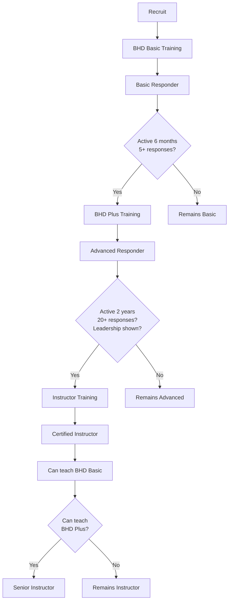

# Program Relawan & Pelatihan

Dokumen ini menjelaskan program relawan KREKI mulai dari kurikulum pelatihan, jalur progresi, hingga standar sertifikasi untuk memastikan kualitas dan kompetensi relawan dalam memberikan bantuan darurat.

## Overview

**Misi Program Relawan:** Membangun jaringan relawan yang kompeten, tersebar di seluruh Indonesia, dan siap memberikan respons cepat saat keadaan darurat kesehatan.

**Filosofi Pelatihan:**
- **Competency-Based** - Fokus pada kemampuan praktis, bukan hanya teori
- **Progressive** - Tingkat kesulutan bertahap dari Basic hingga Advanced
- **Continuous Learning** - Recertification dan upskilling berkala
- **Community-Driven** - Relawan senior melatih relawan baru

---

## Kurikulum Pelatihan BHD

### Struktur Kurikulum

**Total Jam Belajar:**
- BHD Basic: 16 jam (2 hari)
- BHD Plus: 24 jam (3 hari)
- BHD Instructor: 40 jam (5 hari)

### Level 1: BHD Basic (Bantuan Hidup Dasar)

**Target Peserta:** Masyarakat umum, tidak ada latar belakang medis required

**Learning Objectives:**
Setelah mengikuti pelatihan ini, peserta diharapkan mampu:
1. Mengenali kondisi darurat yang memerlukan respons segera
2. Melakukan CPR dasar dengan teknik yang benar
3. Menggunakan AED (Automated External Defibrillator)
4. Menangani choking (tersedak) pada dewasa dan anak
5. Mengontrol pendarahan eksternal
6. Menstabilkan fraktur sederhana
7. Menggunakan HELP 119 app untuk request dan response bantuan

**Modul Pelatihan:**

| Modul | Durasi | Konten | Praktik |
|-------|--------|--------|---------|
| **1. Introduction** | 1 jam | Overview KREKI, peran relawan, etika | Ice breaking |
| **2. Emergency Recognition** | 2 jam | Tanda-tanda bahaya, assessment primer/sekunder | Case studies |
| **3. CPR - Dewasa** | 4 jam | Teknik CPR, compression-to-ventilation ratio | Mannequin practice |
| **4. AED Usage** | 2 jam | Cara menggunakan AED, troubleshooting | AED simulator |
| **5. Choking Management** | 1 jam | Heimlich maneuver, back blows | Paired practice |
| **6. Bleeding Control** | 2 jam | Teknik penekanan, tourniquet (basic) | Bandaging practice |
| **7. Fracture Stabilization** | 2 jam | Splinting, immobilization | Splinting practice |
| **8. HELP 119 App Training** | 1 jam | Cara menggunakan app untuk emergency | App simulation |
| **9. Assessment & Scenario** | 1 jam | Simulation kasus nyata | Role play |
| **Total** | **16 jam** | | |

**Prasyarat:**
- Usia minimal 18 tahun
- Sehat jasmani dan rohani (surat keterangan dokter)
- Memiliki smartphone dengan internet
- Bersedia commit waktu untuk emergency response (minimal 4 jam/minggu)

**Sertifikasi:**
- Valid: 2 tahun
- Assessment: Written test (70% passing) + Practical exam (competency-based)

---

### Level 2: BHD Plus (Advanced Life Support First Responder)

**Target Peserta:** Relawan BHD Basic yang ingin upgrade skill, atau tenaga kesehatan (paramedis, perawat)

**Learning Objectives:**
Setelah mengikuti pelatihan ini, peserta diharapkan mampu:
1. Melakukan CPR tim (2 rescuers)
2. Menggunakan bag valve mask (BVM)
3. Mengelola airway obstruction advanced
4. Menangani shock dan hipotermia
5. Melakukan triage dalam multiple casualties
6. Memberikan obat-obatan emergency (epinefrin untuk anafilaksis, inhaler untuk asma)
7. Meng komunikasi dengan professional healthcare providers
8. Memimpin tim relawan di lokasi kejadian

**Modul Pelatihan:**

| Modul | Durasi | Konten | Praktik |
|-------|--------|--------|---------|
| **1. Advanced CPR** | 4 jam | 2-rescuer CPR, BVM usage | Mannequin team practice |
| **2. Airway Management** | 3 jam | Oropharyngeal airway, suctioning | Airway adjuncts practice |
| **3. Shock & Hypothermia** | 2 jam | Tanda-tanda, penatalaksanaan | Case studies |
| **4. Triage Principles** | 3 jam | START triage, tagging system | Simulation |
| **5. Medication Administration** | 3 jam | Epinefrin, bronkodilator, obat oral | Drug calculation & administration |
| **6. Multiple Casualties** | 4 jam | Koordinasi tim, communication | MCI simulation |
| **7. Professional Communication** | 2 jam | SITREP format, handover procedure | Role play |
| **8. Leadership in Emergencies** | 2 jam | Command structure, decision making | Leadership scenarios |
| **9. Assessment & Exam** | 1 jam | Written + practical exam | |
| **Total** | **24 jam** | | |

**Prasyarat:**
- Sertifikat BHD Basic masih valid (atau baru saja expired < 6 bulan)
- Telah aktif sebagai relawan minimal 6 bulan
- Telah merespon minimal 5 emergency calls
- Rekomendasi dari 1 Volunteer Coordinator

**Sertifikasi:**
- Valid: 2 tahun
- Assessment: Written test (75% passing) + Practical exam (advanced scenarios)

---

### Level 3: BHD Instructor

**Target Peserta:** Relawan BHD Plus yang ingin menjadi trainer, tenaga kesehatan, pendidik

**Learning Objectives:**
Setelah mengikuti pelatihan ini, peserta diharapkan mampu:
1. Mendesain dan mengajar modul pelatihan BHD
2. Mengelola kelas praktik dengan mannequin dan simulator
3. Memberikan feedback yang konstruktif kepada peserta
4. Mengevaluasi kompetensi peserta secara fair dan objektif
5. Meng-update materi pelatihan sesuai perkembangan ilmu

**Modul Pelatihan:**

| Modul | Durasi | Konten | Praktik |
|-------|--------|--------|---------|
| **1. Adult Learning Principles** | 4 jam | Andragogy, learning styles | Micro-teaching |
| **2. Instructional Design** | 4 jam | Lesson planning, module development | Create lesson plan |
| **3. Classroom Management** | 3 jam | Facilitation techniques, handling difficult participants | Mock class |
| **4. Practical Skills Teaching** | 6 jam | Mannequin handling, simulation setup | Teach CPR module |
| **5. Assessment & Evaluation** | 4 jam | Rubric development, practical exam design | Create assessment tool |
| **6. Feedback & Coaching** | 3 jam | Giving feedback, coaching skills | Peer coaching |
| **7. Curriculum Update** | 4 jam | Latest AHA/ERC guidelines, evidence updates | Journal club |
| **8. Teaching Practicum** | 8 jam | Co-teaching actual BHD class | Real class observation |
| **9. Final Assessment** | 4 jam | Teach full module + exam | |
| **Total** | **40 jam** | | |

**Prasyarat:**
- Sertifikat BHD Plus masih valid
- Telah aktif sebagai relawan minimal 2 tahun
- Telah merespon minimal 20 emergency calls
- Rekomendasi dari 2 Volunteer Coordinators
- Passion untuk mengajar

**Sertifikasi:**
- Valid: 3 tahun
- Assessment: Teaching demonstration (80% passing) + Curriculum project

---

## Jalur Progresi Relawan

### Career Path

### Role Definitions

**Basic Responder:**
- Dapat merespon emergency SEV-3 dan SEV-2 (dengan supervision)
- Dapat melakukan CPR, use AED, control bleeding
- Dapat menjadi Supporting Volunteer untuk Team Lead

**Advanced Responder:**
- Dapat merespon semua emergency levels (SEV-1, SEV-2, SEV-3)
- Dapat menjadi Team Lead di lokasi kejadian
- Dapat membuat keputusan klinis dasar (eskalasi ke PSC 119)
- Dapat mengoordinasikan multiple casualties

**Instructor:**
- Dapat mengajar kelas BHD Basic
- Dapat mengevaluasi kompetensi peserta
- Dapat meng-update materi pelatihan

**Senior Instructor:**
- Dapat mengajar BHD Basic dan BHD Plus
- Dapat melatih calon Instructor baru
- Dapat mengembangkan kurikulum baru

---

## Standar Sertifikasi

### Sertifikasi BHD Basic

**Requirements:**
- Lulus pelatihan 16 jam
- Lulus written test (minimal 70%)
- Lulus practical exam dengan kompetensi:
  - CPR: 30 kompresi dalam 18 detik dengan depth 5-6 cm
  - AED: Dapat menempelkan pad dengan benar dan mengikuti prompt
  - Choking: Dapat melakukan Heimlich maneuver dengan benar
  - Bleeding control: Dapat mengontrol pendarahan dengan tekanan langsung
  - Fracture: Dapat melakukan splinting sederhana

**Format Sertifikat:**
- ID Unik: BHD-BASIC-YYYY-XXXX (contoh: BHD-BASIC-2025-0001)
- Nama lengkap
- Tanggal sertifikasi
- Tanggal kadaluarsa (2 tahun)
- QR Code untuk verifikasi
- Digital signature dari Lead Instructor

**Issuance:**
- Digital certificate di HELP 119 app
- PDF download dari LMS
- Physical certificate (opsional, on request)

### Sertifikasi BHD Plus

**Requirements:**
- Lulus pelatihan 24 jam
- Lulus written test (minimal 75%)
- Lulus practical exam dengan kompetensi:
  - 2-rescuer CPR dengan transisi yang smooth
  - BVM usage dengan E-C clamp technique
  - Triage dengan START protocol yang benar
  - Medication calculation dan administration yang tepat
  - Leadership dalam scenario (mengarahkan team)

**Format Sertifikat:**
- ID Unik: BHD-PLUS-YYYY-XXXX
- Nama lengkap
- Tanggal sertifikasi
- Tanggal kadaluarsa (2 tahun)
- QR Code untuk verifikasi
- Digital signature dari Senior Instructor

### Sertifikasi Instructor

**Requirements:**
- Lulus pelatihan 40 jam
- Lulus teaching demonstration (minimal 80%)
- Lulus curriculum project
- Co-teaching minimal 2 kelas dengan satisfactory rating

**Format Sertifikat:**
- ID Unik: BHD-INST-YYYY-XXXX
- Nama lengkap
- Tanggal sertifikasi
- Tanggal kadaluarsa (3 tahun)
- QR Code untuk verifikasi
- Digital signature dari Head of Training

---

## Re-Certification

### Kebijakan Re-Certification

**BHD Basic & BHD Plus:**
- Valid: 2 tahun
- Re-certification required: 3 bulan sebelum expired
- Options:
  1. Full refresher course (16/24 jam) - Recommended jika jarang praktik
  2. Accelerated re-certification (8/12 jam) - Hanya untuk yang aktif merespon emergency

**Re-Certification Requirements:**
- Telah merespon minimal 10 emergency calls dalam 2 tahun (terverifikasi di HELP 119 app)
- Lulus practical exam fokus pada skills yang paling krusial
- Update materi: New guidelines, changes in protocol
- Fee: Gratis untuk relawan aktif, Rp 200.000 untuk yang tidak aktif

**Instructor:**
- Valid: 3 tahun
- Re-certification required: 6 bulan sebelum expired
- Requirements:
  - Telah mengajar minimal 3 kelas dalam 3 tahun
  - Participant feedback rating minimal 4/5
  - Lulus teaching re-demonstration

### Grace Period

- Sertifikat expired > 6 bulan: Harus ambil full course kembali
- Sertifikat expired < 6 bulan: Dapat mengambil accelerated re-certification

---

## Quality Assurance

### Monitoring Kompetensi

**Post-Training Assessment:**
- 1 bulan post-training: Online quiz untuk refresh knowledge
- 6 bulan post-training: Skills check via video submission (CPR, AED usage)
- 12 bulan post-training: Simulation session di chapter meeting

**Emergency Response Review:**
- Setiap emergency yang ditangani relawan di-review oleh Volunteer Coordinator
- Feedback diberikan dalam 48 jam
- Patterns yang perlu improvement diidentifikasi untuk remedial training

### Instructor Performance

**Evaluation Metrics:**
- Participant pass rate (target: > 85%)
- Participant satisfaction (target: > 4/5)
- Participant competency retention 6 bulan post-training (target: > 80%)
- Adherence to curriculum

**Remediation:**
- Instructor dengan pass rate < 70% harus co-teach dengan Senior Instructor
- Instructor dengan satisfaction < 3/5 harus mengajar micro-teaching refresher

---

## LMS Platform Features

### Digital Learning

**Video Modules:**
- Pre-recorded video untuk teori (dapat diakses asynchronous)
- Interactive quiz setelah setiap video
- Progress tracking di dashboard

**Virtual Simulation:**
- VR/AR based simulation untuk practice scenario
- AI-powered feedback untuk CPR technique
- Gamification untuk engagement

**Live Sessions:**
- Zoom/Google Meet untuk practical sessions (dengan mannequin di rumah masing-masing)
- Instructor dapat memantau dan memberikan feedback real-time

### Assessment

**Online Testing:**
- Auto-graded multiple choice questions
- Timed exam untuk simulasi tekanan
- Randomized question bank

**Practical Exam Submission:**
- Video submission untuk practical skills
- Peer review untuk basic skills
- Instructor grading untuk advanced skills

**Certificate Issuance:**
- Automatic certificate generation setelah lulus
- Blockchain-based verification (optional, untuk tamper-proof)
- Integration dengan HELP 119 app untuk auto-verification

---

## Related Documentation

- [Contribution Guide](../contribution-guide.md) - Cara menjadi relawan
- [Emergency Response Playbook](../emergency-playbook.md) - Peran relawan dalam emergency
- [Microservices Design](../microservices-design.md) - LMS service specifications

---

*Kembali ke [About](./index.md)*
